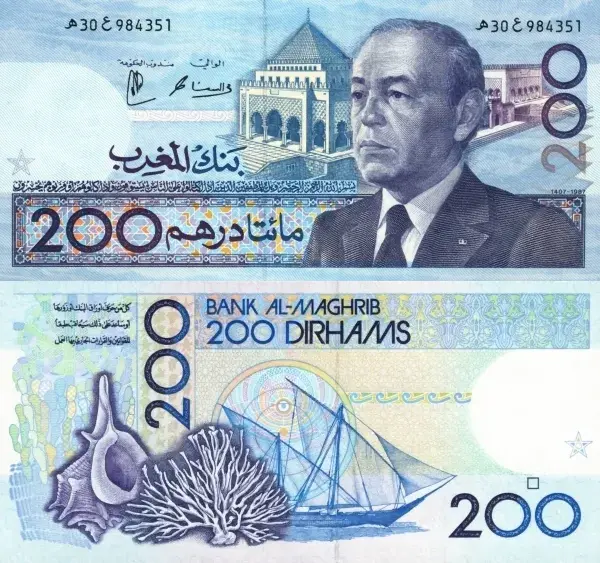
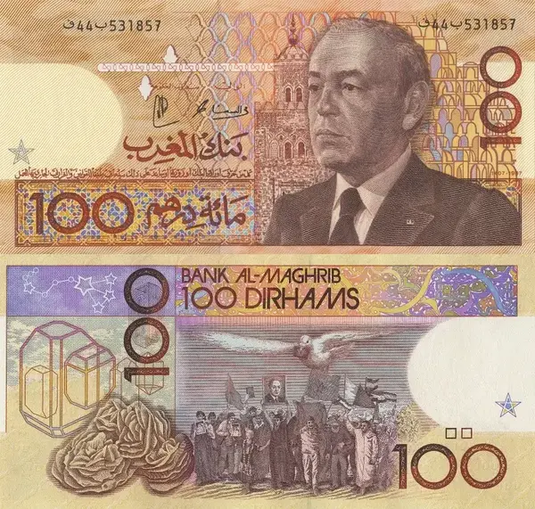
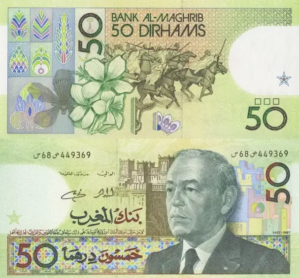
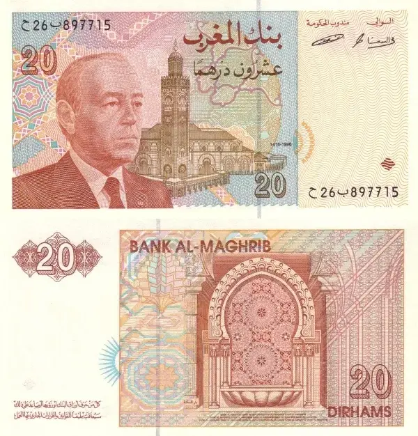
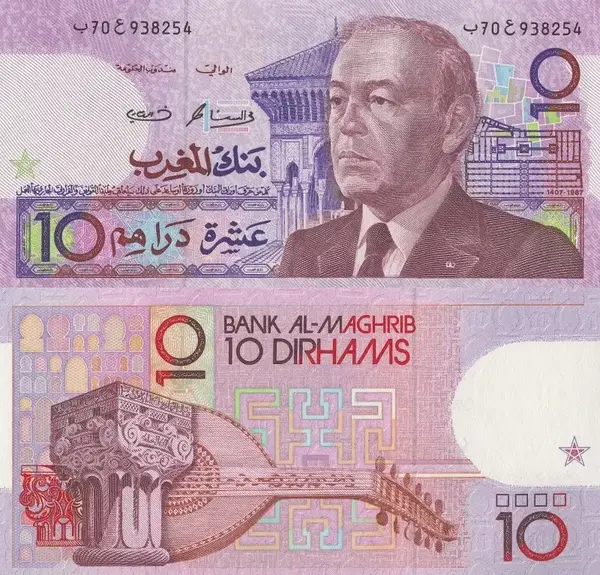
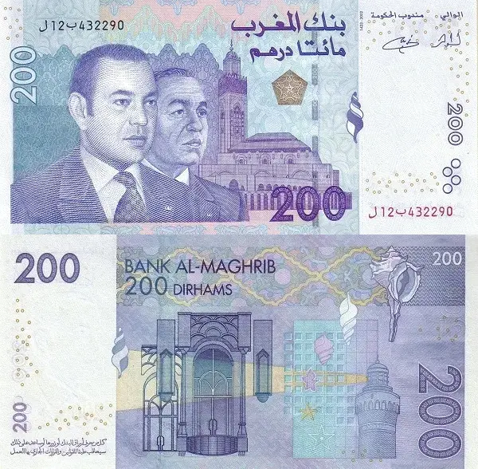
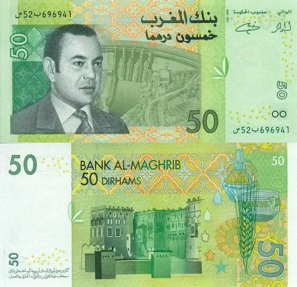
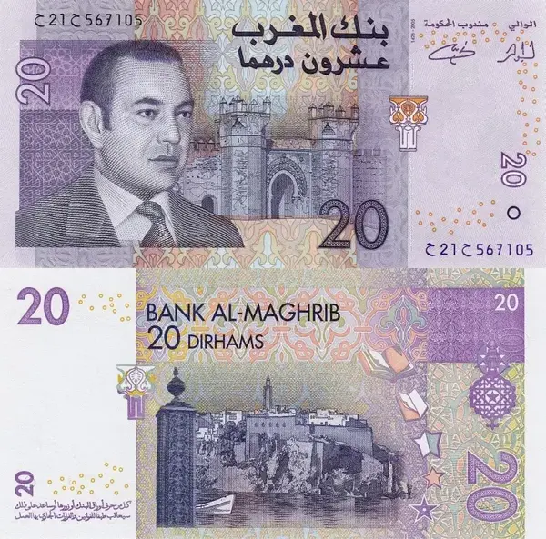
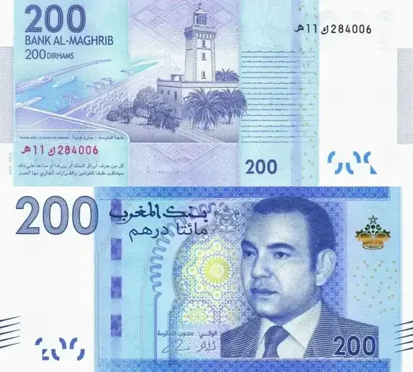
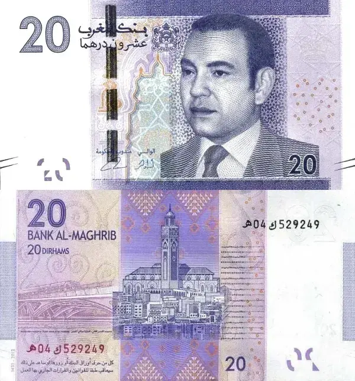

Paper currency can convey significant information regarding a nation, encompassing its historical and cultural aspects. In this article, we will explore Morocco's banknotes starting from 1987 up to the present time, unveiling the concealed stories on both sides.

## 1987 - 1996 (King Hassan II)
This is the second banknote release during King Hassan II reign.

### 200 Dirhams - issued in 1987

**Front**
* King Hassan II
* Mausoleum of Mohammed V - Rabat

**Back**
* Coral, Conch, ... - Mediterranean and Atlantic coasts

### 100 Dirhams - issued in 1987

**Front**
* King Hassan II
* Koutoubia Mosque - Marrakech

**Back**
* Green March 1975 - Tarfaya (Saguia El Hamra)
* Desert Rose (Crystal) - Moroccan Sahara

### 50 Dirhams - issued in 1987

**Front**
* King Hassan II
* Amridil Kasbah - Skoura (Ouarzazate)

**Back**
* Tbourida (Fantasia) - All over Morocco
* Saffron Plant - High Atlas

### 20 Dirhams - issued in 1996

**Front**
* King Hassan II
* Hassan II Mosque - Casablanca

**Back**
* Architectural details from Hassan II Mosque - Casablanca

### 10 Dirhams - issued in 1987

**Front**
* King Hassan II
* University of al-Qarawiyyin - Fez

**Back**
* Oud (Musical instrument) - All over Morocco
* Pillar from Attarine School - Fez

---

## 2002 - 2005 (King Mohammed VI - 1st release)
This release features the 3 kings of Morocco Mohammed VI (current) and, Father Hassan II and his grandfather Mohammed V.

### 200 Dirhams - issued in 2002

**Front**
* Two Morroco Kings Mohammed VI (current) and his father King Hassan II
* Hassan II Mosque - Casablanca

**Back**
* Hassan II Mosque interior - Casablanca
* El-Hank Lighthouse - Casablanca
* Twin Center - Casablanca

### 100 Dirhams - issued in 2002

**Front**
* Three Morroco Kings Mohammed VI (current), his father King Hassan II and his grandfather King Mohammed V
* Mausoleum of Mohammed V - Rabat
* Moroccan Architecture

**Back**
* Green March 1975 - Tarfaya (Saguia El Hamra)
* Amazigh Tazrzit - All Over Morocco

### 50 Dirhams - issued in 2002

**Front**
* King Mohammed VI
* Mohammed V water Dam - Nador
* Olive leaf - Morocco is the 3rd producer of olive oil in the world

**Back**
* Moroccan Kasbah (looks like Taourirt) - High Atlas
* Wheat - plains in central and the west of Morocco produce the most
* Water containers - All over Morocco

### 20 Dirhams - issued in 2005

**Front**
* King Mohammed VI
* Bab Chellah - Rabat
* Moroccan Architecture, Zellij - All over the Morocco

**Back**
* Oudaya's Kasbah - Rabat

---

## 2013 (King Mohammed VI - 2nd release)
All the 2013's banknotes feature on the their front side a picture of King Mohammed VI and a different style of Archway/Door architecture found no place but in Morocco. Also each bill's front dislays a variation of Moroccan Zellij (Mosaic).

### 200 Dirhams - issued in 2013

**Back**
* Cap Spartel - Tangier
* Tanger Med Port - Tangier

### 100 Dirhams - issued in 2013

**Back**
* Nomads on Camels - Moroccan Saharas
* Amazigh Nomad tents
* Wind farm - All over the country (Tangier are the most known)

### 50 Dirhams - issued in 2013

**Back**
* Ouzoud Waterfalls - Azilal
* Argan Tree - Souss Massa
* Traditional millstones - Souss Massa
* Moroccan Falcon - All over the country

### 20 Dirhams - issued in 2013

**Back**
* Hassan 2 Mosque - Casablanca
* LGV Train on a Bridge - Rabat

## Bonus: A map
<iframe src="https://www.google.com/maps/d/u/0/embed?mid=1sNLHQXD4K2BZkby2wuXTxDKSVpQHxTk&ehbc=2E312F" width="100%" height="480"></iframe>
