**Mohammed V Boulevard**, formerly known as "Boulevard de la Gare" during the French protectorate, is one of the most iconic and beautiful streets in Casablanca. In this post, we'll take a walk down Mohammed V Boulevard, admiring its stunning architecture and exploring the various styles Casablanca has to offer, including [Neo-Moorish](https://en.wikipedia.org/wiki/Moorish_Revival_architecture), [Art Nouveau](https://en.wikipedia.org/wiki/Art_Nouveau), [Art Deco](https://en.wikipedia.org/wiki/Art_Deco) and more.

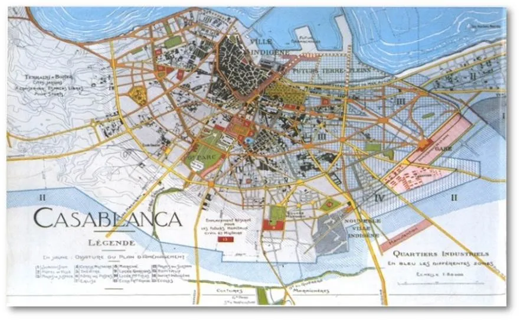

Mohammed V Boulevard was first included in *Henri Prost*'s 1914 plan, intended to connect the train station (now **Casa Voyageurs**) to the **Old Medina** and specifically France Square (now **United Nations Square**). The street opened in 1918, and since then, numerous new buildings have been constructed.

:::note[💡 The history of Casablanca's urbanism]
According to the [Urbain Agency of Casablanca](https://auc.ma/gestion-planification-urbaine/schema-directeur-damenagement-urbain/plan-prost/), the city has undergone five urban planning initiatives. 

The first two occurred during the protectorate, resulting in major neighborhoods like the now Sidi Belyout, Mers Sultan, Roches Noires, Habous, Maarif, and later Hay Hassani, Hay Mohammadi, Ain-Chock, and Sidi Othmane. 

After independence, Casablanca entered the Grand Casablanca era, implementing three "Schémas Directeurs d'Aménagement Urbain" over 40 years. 

💡 Casablanca was one of the first cities in the world where the new discipline of "urbanism" was applied.
:::

## First steps from the train station
### Casa Voyageurs - 1923
Let's start at the beginning of the street: **Casa Voyageurs train station**. Inaugurated in 2018, the new station is one of the largest in Morocco and serves as the terminus for the high-speed train Al Boraq. 

Nearby, you'll find the old train station from 1923, which still stands in its Neo-Moorish style.

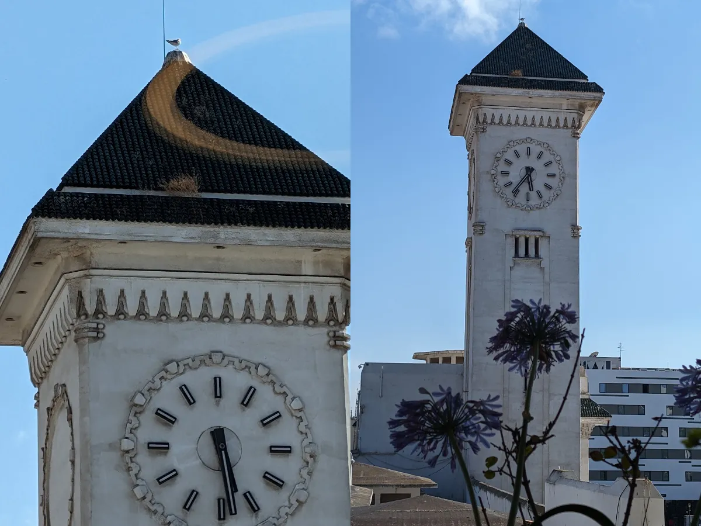

### Immeuble de la Gare - 1920s
As you follow Boulevard Mohammed V (along the tram tracks), be sure to look up and appreciate the blend of new and old architecture. 

When you reach the roundabout connecting Mohammed V and Boulevard La Resistance, on your right you'll see one of the largest buildings on the street, the **Train Station building (Immeuble de la gare)**, built in the 1920s, likely it was intended to accommodate workers and officials from the train station.

:::note[💡 Henri Prost: the architect of the new Metropilitan]
When the young architect [Henry Prost](https://en.wikipedia.org/wiki/Henri_Prost) arrived in Casablanca in 1914 at the request of Resident General Hubert Lyautey, he encountered a city rapidly expanding both within and beyond its walls. The chaotic sprawl and the dominance of the [protected](https://en.wikipedia.org/wiki/Prot%C3%A9g%C3%A9_system) landowners and private developers outside the walls posed a significant challenge to his plans. 

> At first glance, it was an unbelievable chaos, with no possible roads, as the development had been so rapid, everywhere at once and in all directions. - H. Prost

Despite the disorder and the challenge he faced at first, he believed Casabalanca had the potential to become the largest metropolis in Morocco and one of the largest in Africa.

With assistance from the French residency and the Makhzen, he initiated his plan by inaugurating the administrative square (Mohammed V Square), followed by the creation of new streets such as Boulevard de la Gare (Mohammed V Street).
:::

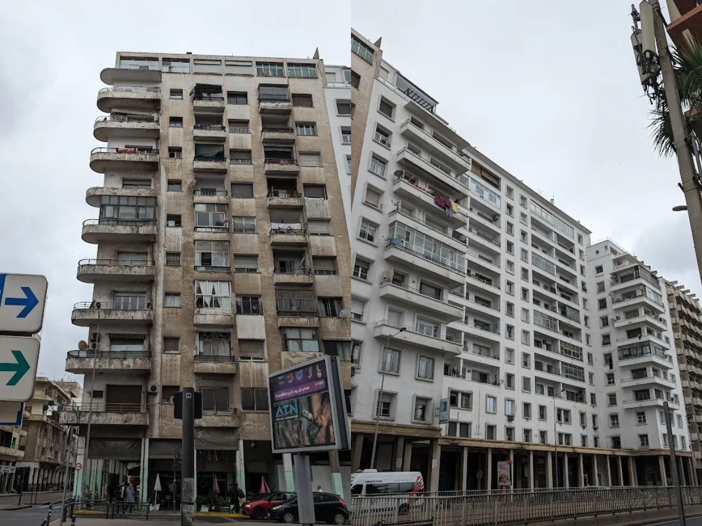

| Building | Date | Architects |
| --- | --- | --- |
| La Gare building | 1920s | - |

## From Bd La Resistance to the battle of Skyscrapers
### Immeuble Shell - 1934
Continue along Mohammed V Boulevard, and at the next roundabout, you'll find one of the most beautiful buildings on the street, designed in 1924 by French architect *Marius Boyer* as the headquarters for the Anglo-Dutch Oil company Shell. 

Renovated in 2013, the building now houses **Imperial Hotel**.

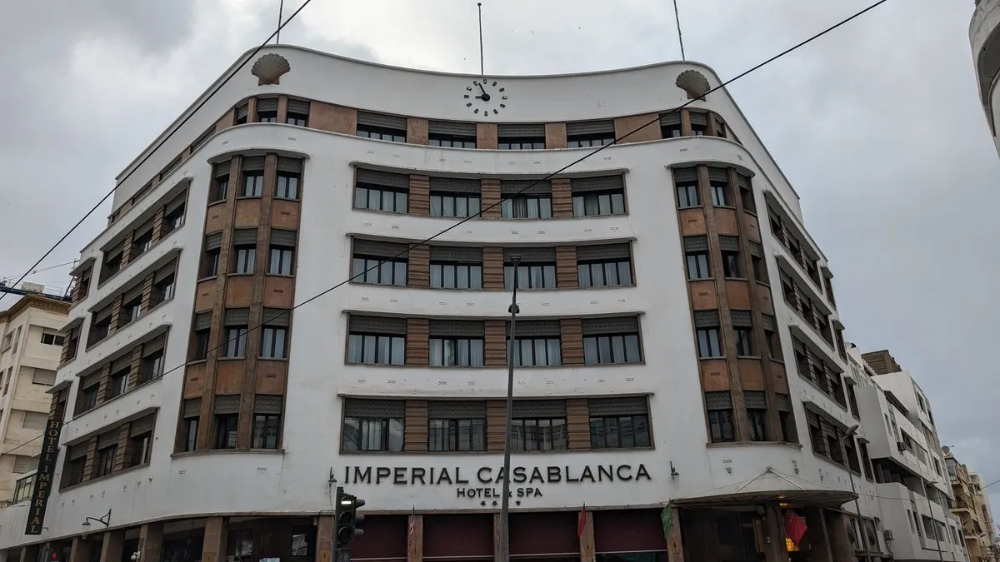

| Building | Date | Architects |
| --- | --- | --- |
| Shell building | 1934 | Marius Boyer |

### Royal Garage | Garage Renault | Immeuble La Fraternelle du Nord 
On your left, head down Rue de Karachi, and a few buildings later on your right, you'll find the **Royal Garage**, built in 1957 to serve the neighborhood's growing parking needs.

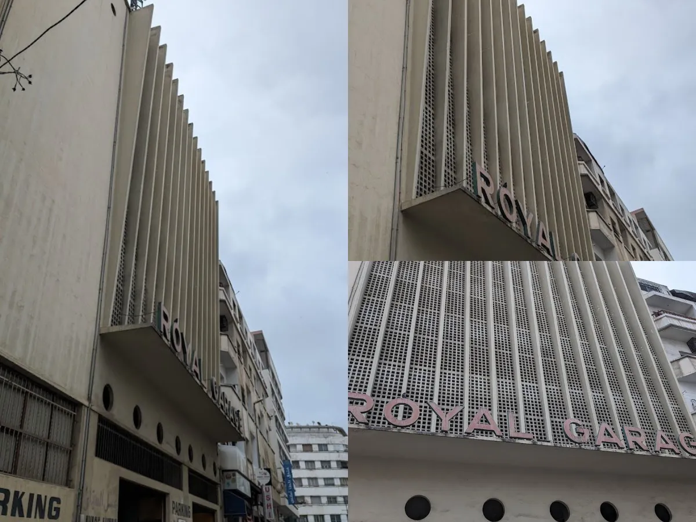

On the same street, there's an old garage for the French car manufacturer Renault from 1953, which is now converted into a post office.

:::note[💡 Casablanca: Road to the economical capital]
Since its foundation by Sultane [Mohammed Ben Abdellah](https://en.wikipedia.org/wiki/Mohammed_ben_Abdallah) in the late 18th century, Casablanca established itself as a potential economic hub due to its strategic coastal location and position along the route connecting the main imperial cities of Morocco. The development of the port and the fertile Chaouia plains further enhanced its advantages over neighboring cities. 

After the French protectorate was established, French authorities recognized Casablanca's potential and began investing heavily in the city, aiming to rule over Morocco through the axis of 3 cities: Casablanca as the economic hub, Rabat as the administrative capital, and Kenitra (then Port-Lyautey) as the military base.

A few years into the protectorate, effective [promotion](https://gallica.bnf.fr/ark:/12148/btv1b10539169z) by the French residency attracted investors from Europe and Morocco's imperial cities like Fez, Marrakech, and Tangier. The city's population grew exponentially due to this influx of investors and the [migration](https://www.persee.fr/doc/estat_1149-3720_1946_num_1_3_10059#estat_1149-3720_1946_num_1_3_T1_0059_0000) of laborers from neighboring (and far away) rural areas, driven by economic opportunities and adverse climatic conditions elsewhere.

This created a snowball effect, solidifying Casablanca's status as the emerging economic capital of the country. The city became home to major banks such as Companie Algerienne, Credit Lyonnais, and the British West African Bank, among others. Additionally, it attracted automotive manufacturers like Citroën, Fiat, Volkswagen, Volvo, and the Moroccan Auto-Hall. Casablanca also saw the establishment of numerous headquarters for industrial companies across various [sectors](https://www.entreprises-coloniales.fr/maroc.html), including mining, energy, metals, construction, and food production ...
:::

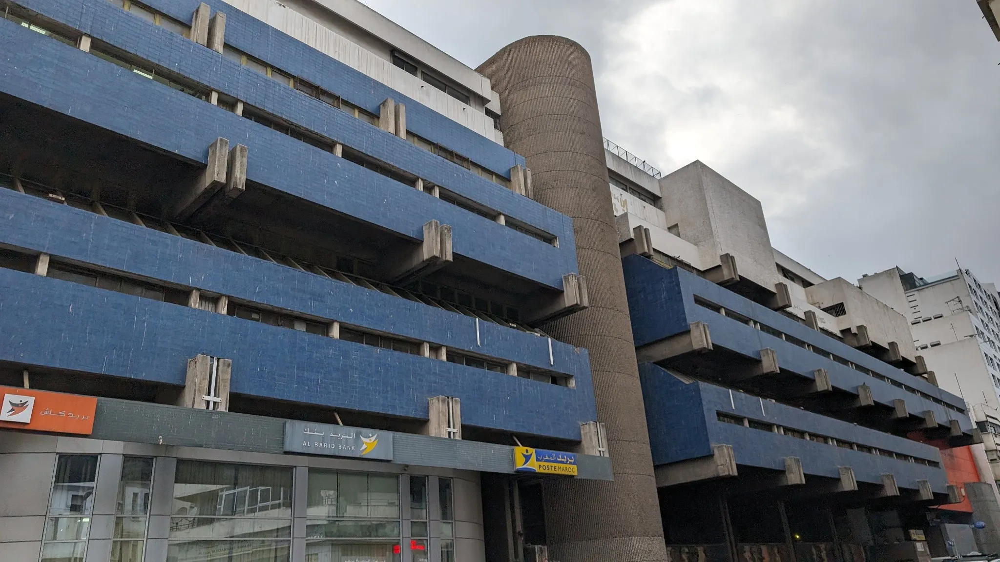

Across from the Bondongue roundabout, you'll find another building, 20 years older than the previous two. **La Fraternelle du Nord building** is a set of 8 attached buildings originally built for the French insurance company La Fraternelle du Nord.

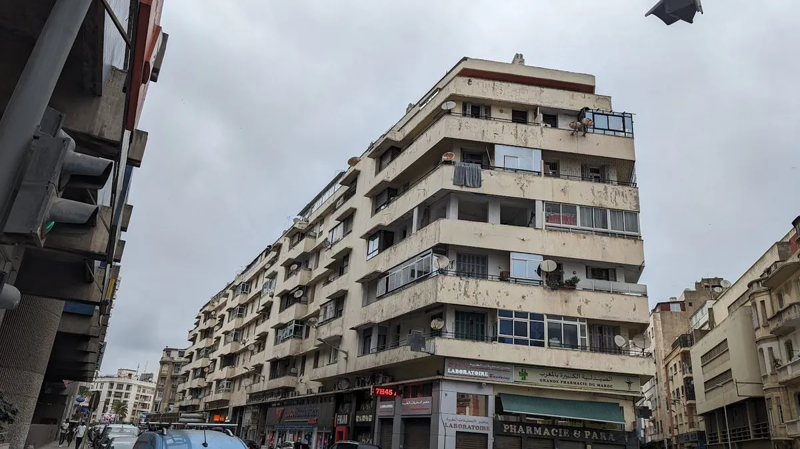

| Building | Date | Architects |
| --- | --- | --- |
| Royal Garage | 1957 | Amédée Anicet & Louis Perrin-Hoppenot | 
| Renault Garage | 1953 | Jean-François Robert |
| La Fraternelle du Nord Building | 1932 | Marcel Desmet | 

### Immeuble Villa Paquet | Immeuble Marignan
Return to Mohammed V Boulevard via rue Mohammed Diouri, and a few meters later you'll reach Paquet roundabout. Enjoy the sight of two buildings that used to compete for the tallest building in Mohammed V Street prize.

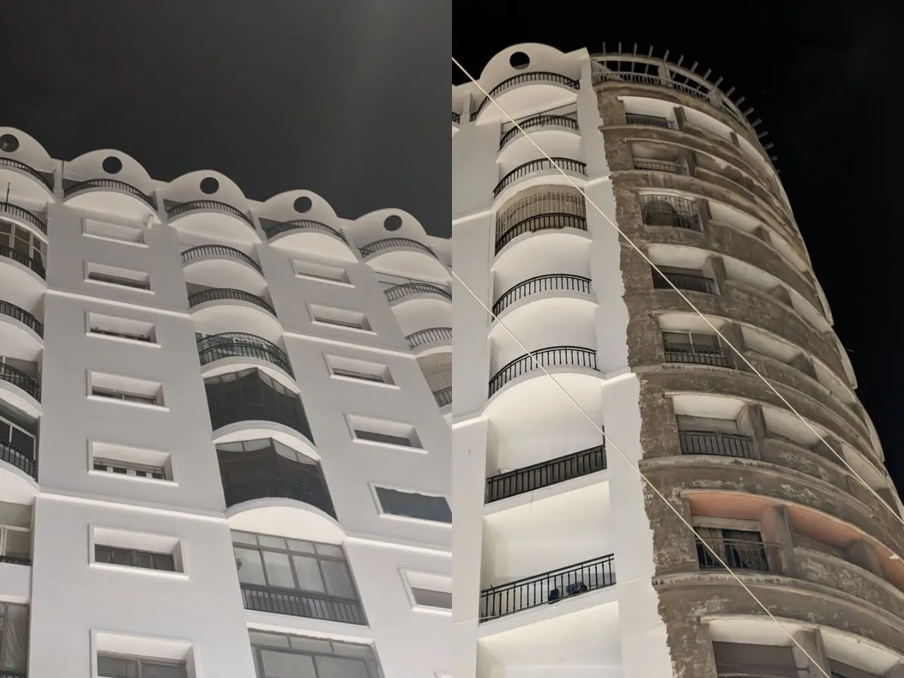

Today, 12-story **Marignan Building** (1950) and the taller 16-story **Villa Paquet building** (1952) remain some of the tallest buildings on Mohammed V Boulevard.

:::note[💡 Casablanca, the city of Contrasts]
During the first half of the 20th century, Casablanca was regarded as a laboratory for modern architecture, attracting architects from around the world eager to experiment with their most innovative ideas. This period fostered a rich blend of architectural styles, including **Neo-Moorish** (evident in buildings around Mohammed V Square), **Art Deco** (exemplified by the Bon Marché Building), and **Art Nouveau** (such as the Alexandre Building), as well as **brutalist** designs (like the Crédit du Maroc Building) ...

In Casablanca, many decorative and architectural techniques were borrowed from both Moroccan and European traditions. This included for instance the use of Zellij, bow windows, floral patterns and decoration, decorative ironwork and domes on various buildings. 

Additionally, during the same era, the city saw the establishment of many notable villas (such as Villa les Tourelles) on one hand, and on the other hand skyscrapers (like Villa Paquet), and residential compounds that spanned multiple styles (Cité Habous and Cité Ain Chock).

💡: Bidonville is a french term used to denote informal suburban neighborhoods is originated in casablanca. Workers who migrated to the city and could not afford housing used tin containers (Bidon) from the factories to build the roofs for their makeshift buildings.  

💡: "Carian" denoting Slum in Moroccan darija, also originated from Casablanca. The first slums in Casablanca were built by workers who worked quarries "Carrière" which was altered later to "Carian".
:::

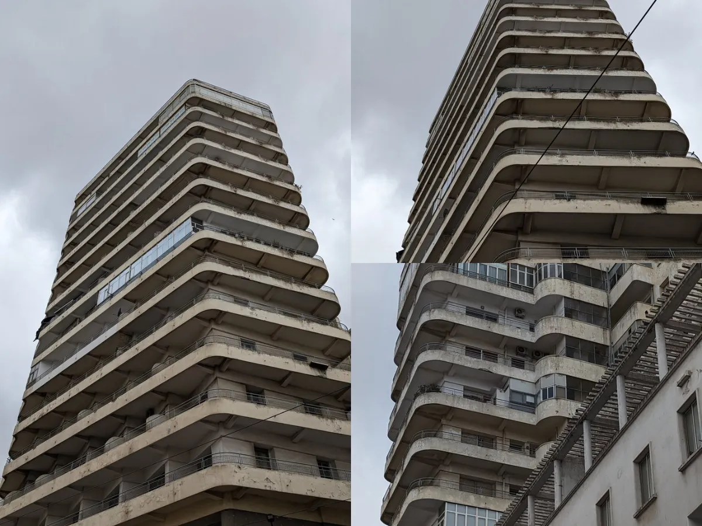

| Building | Date | Architects |
| --- | --- | --- |
| Marignon Building | 1950 | - | 
| Villa Paquet | 1952 | Jacques Gouyon |

## Road to Derb Omar
### Immeuble Maret 
If you have some time, take a right turn to visit two other buildings from the 1920s. First, you'll come across one of the first football stadiums in Morocco, **Laarbi Ben Mbarek Football Stadium** (1919). Then, you'll pass by **Augustin Sourzac School**, one of the oldest schools in the neighborhood, with one of the most beautiful entrances in Casablanca.

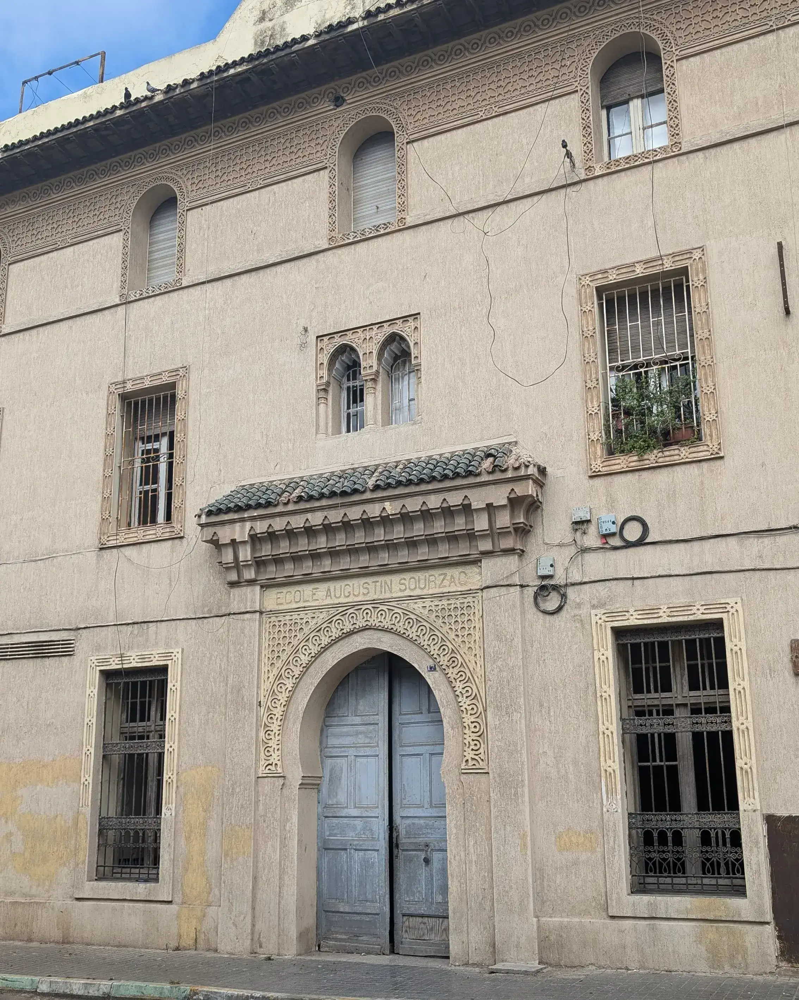

Return to Mohammed V Boulevard, and once back on the street, you'll find the **Maret Building**, one of the most beautiful buildings in Casablanca, with a wavy facade, Zellij on one of the floors, and a unique dome covered in Zellij.

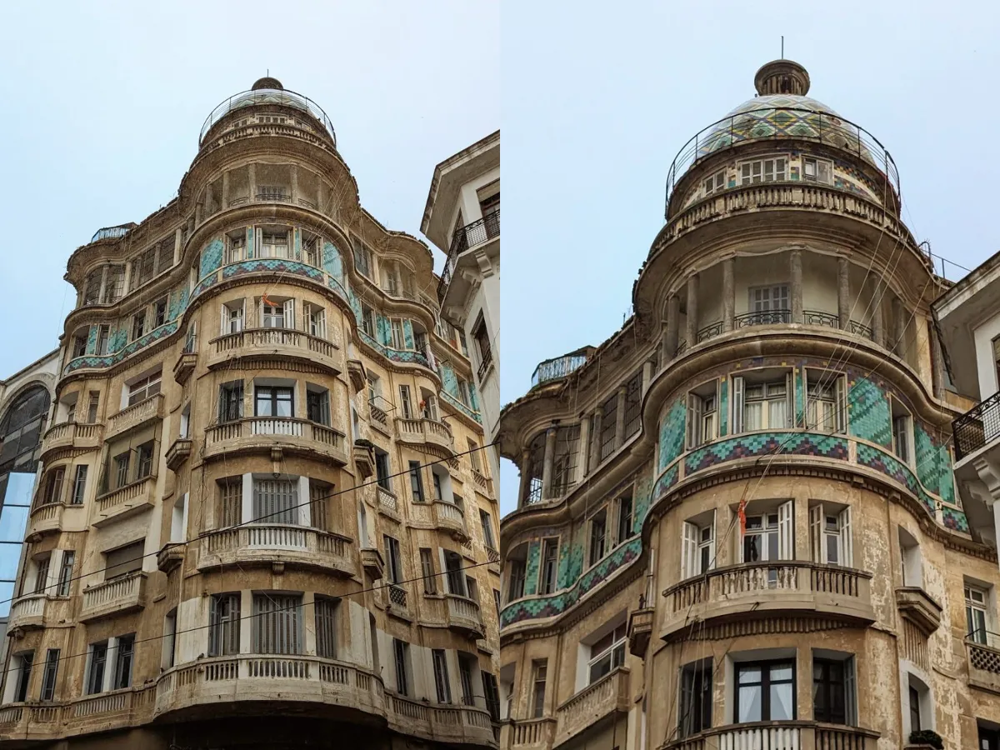

| Building | Date | Architects |
| --- | --- | --- |
| Laarbi Ben Mbarek Stadium | 1919 | - | 
| Augusting Sourzac School | 1925 | Pierre Bousquet |
| Maret Building | 1932 | Hippolyte-Joseph Delaporte |

:::note[💡 Marius Boyer]
Following the establishment of the protectorate, Marshal Lyautey invited architects from around the world to come to Casablanca to help create a dream city. Responding to this call, Marius Boyer arrived in Casablanca and embarked on his architectural journey in Morocco.

Upon his arrival, he partnered with Jean Balois from 1925 to 1929, collaborating on several projects, including the **Wilaya building (Hôtel de Ville)**, **the military base** in Mohammed V Square, and various hotels such as **Hôtel Volubilis**, **Hôtel Atlas**, and the renowned **Hôtel Anfa**.

Marius Boyer is renowned for numerous buildings that still stand today, including the **Assayag Building**, **Levy Bendayan Building**, and **Glaoui Building**. He was one of Casablanca's most prolific architects, and he passed away in the same city in 1947.
:::

### Immeuble Levy et Charbon | Immeuble Assayag | Immeuble CTM 
Take a detour to the next parallel street, Boulevard Hassan Seghir. Turn right and advance a little bit to find two more beautiful buildings. The first on your right is the **Levy et Charbon Building**, standing with a beautiful facade decorated with two domes on the corners.

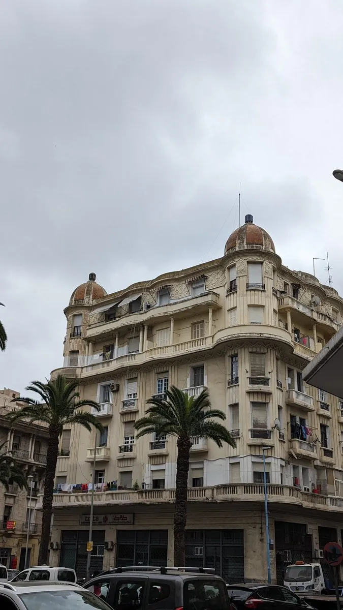

On your left, you'll see one of the most complex and beautiful buildings by *Marius Boyer*, built for the Jewish entrepreneur *Moses Assayag*.

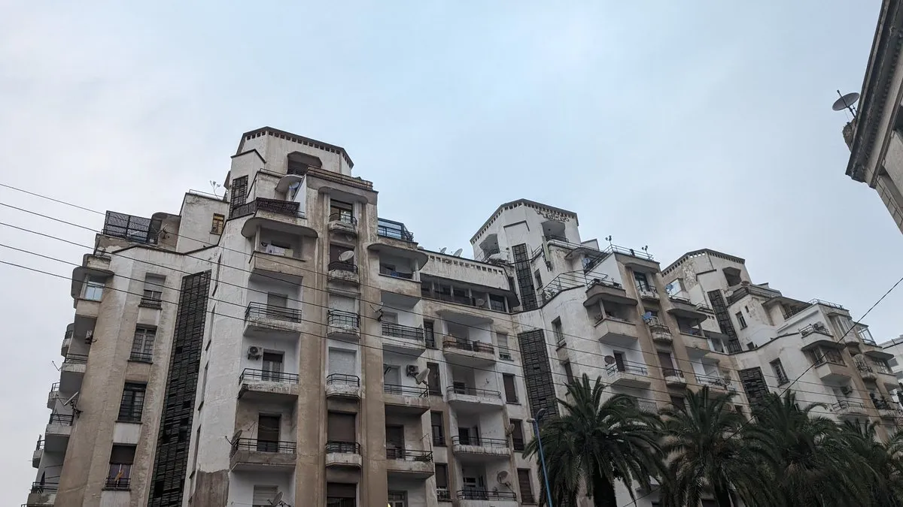

:::note[💡 The Jewish community in Casablanca]
Originally restricted to the Mellah under Dhimma law, [Jewish financiers](https://www.judaisme-marocain.org/objets_popup.php?id=21590) began acquiring significant land outside the city walls as collateral for loans to Muslim borrowers. Although they couldn't develop this land due to legal restrictions, they built up a large real estate portfolio. 

As Casablanca expanded in the early 20th century, these Jewish landowners played a crucial role in the city's development, transforming from a marginalized group into significant players in the local property market. 

During this period, Jews gradually moved from the Mellah to areas outside the wall, giving rise to the new [Lusitania Quarter](https://www.city-info.ma/casablanca/fr/distrs/2548224046/12/).

Notable [Jewish figures](https://www.quest-cdecjournal.it/wp-content/uploads/2021/10/1-Q19_04_Cohen.pdf) of Casablanca are Benarosh, Bendahan, Assayag, Ettedgui, Mellul and Benzaken ...
:::

At the end of Hassan Seghir street, on your left, you'll find the **CTM Building**, built in the mid-50s to house people working in the nearby bus company headquarters.

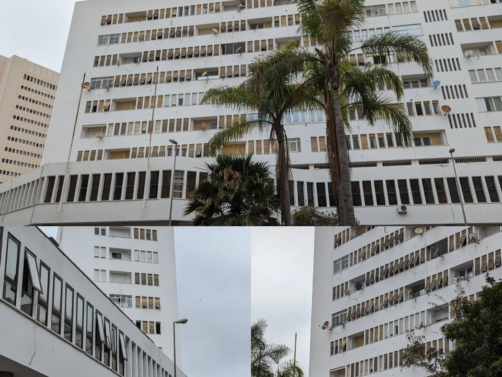

| Building | Date | Architects |
| --- | --- | --- |
| Levy & Charbon Building | 1929 | Ignacio Sansone & Paul Busuttil | 
| Assayag Building | 1932 | Marius Boyer |
| CTM Building | 1955 | Alexandre Courtois |

### Immeuble Bessonneau | Garage Coli | SA Mutual Mortgage Company 
Return to Mohammed V Boulevard, either from where you came or via Rue Chaouia. Continuing in the same direction, on your left, you'll find the **Bessonneau Building**, also known as **Lincoln Hotel**, which was one of the oldest hotels in Casablanca and Africa as a whole. 

At the time of writing this post, the hotel is being renovated and will join the Radisson collection of hotels.

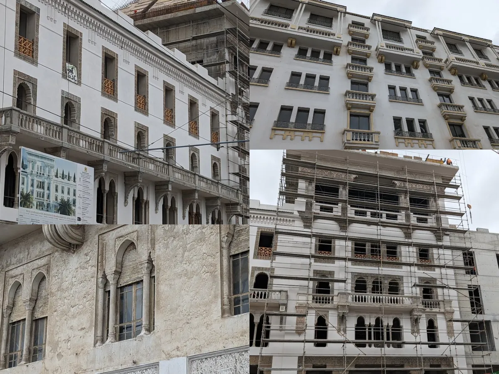

If you're feeling adventurous, head to the back of the hotel to **Derb Omar** neighborhood via Rue Abdellah El Mediouni or Rue Ibn Batouta. You'll find two beautiful buildings: **South American Mutual Mortgage Company Building** and **Coli Garage building** (now **Hotel Coli**), both hosting businesses on the ground floor.

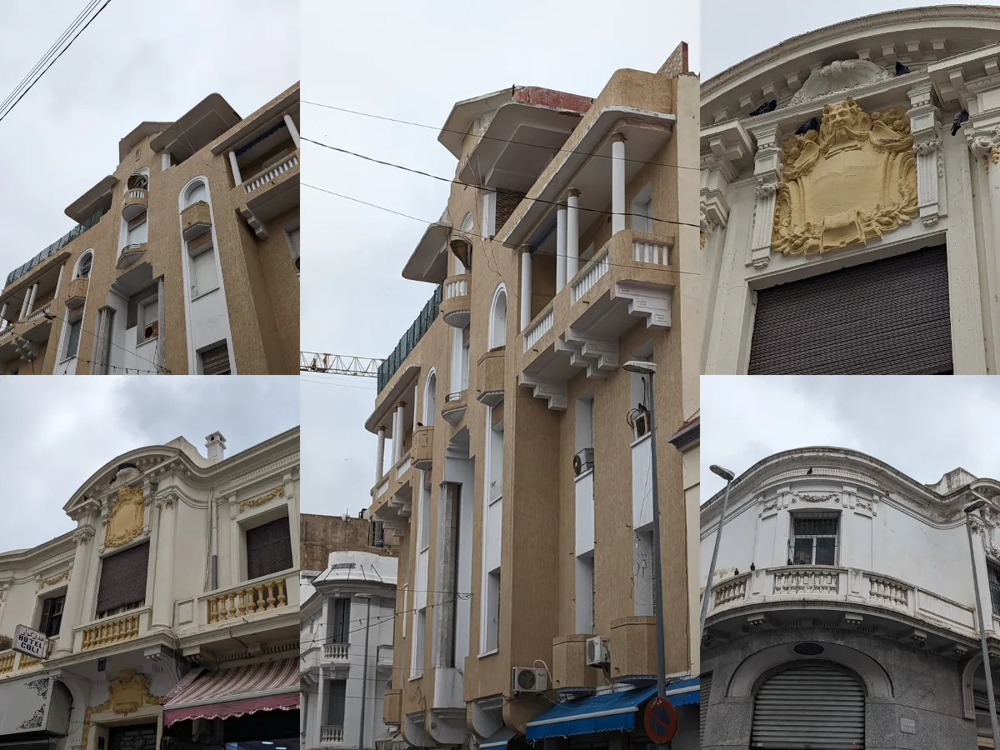

| Building | Date | Architects |
| --- | --- | --- |
| Bessonneau Building | 1917 | Hubert Bride | 
| Garage Coli Building | 1955 | Amédée Anicet |
| South American Mutual Mortgage Company Building | 1929 | Marius Boyer & Jean Balois |

## The main chapter of the boulevard 
### Marché Central | Immeuble Martinet 
Return to Mohammed V Boulevard via Rue Ibn Battouta. In front of you is the central market (**Marché Central**), one of the most significant markets in Casablanca's history.

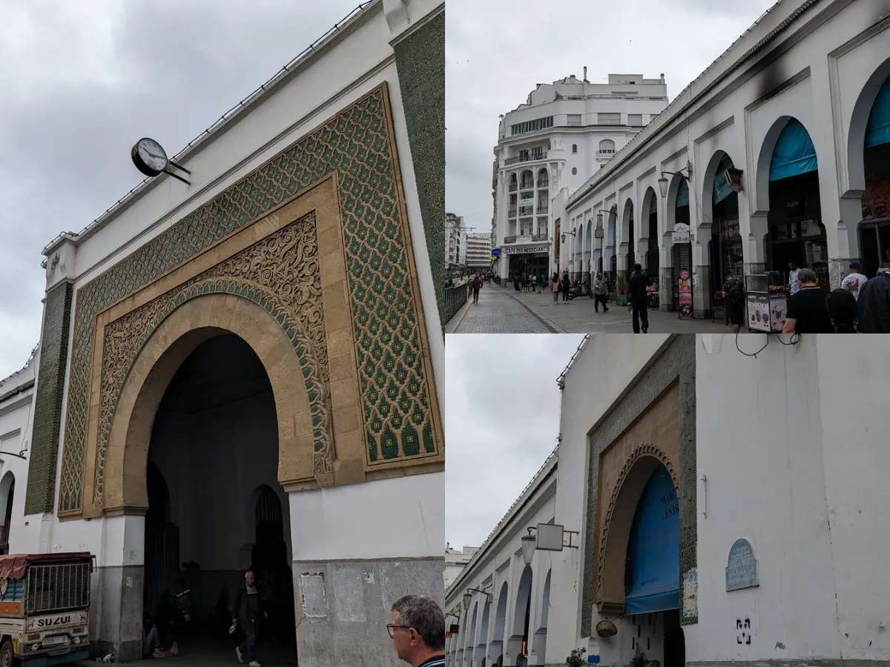

:::note[💡 The inception of Marché Central]
At the start of the French protectorate, the main market in Casablanca, located outside the city walls, was situated where the United Nations Square (formerly France Square) now stands. One of the challenges faced by the French General Director was finding a way to replace the existing souk with a new market that would offer better hygiene and improved standards.

Once the new location for the market was chosen, Lyautey's office began [negotiations](https://shs.hal.science/halshs-00127045/document) with the landowner, Salvador Hassan, through his representative Haim Bendahan, to exchange the lands. After several rounds of discussions, the two parties reached an agreement, and the land was exchanged.

Following multiple adjustments to the market's design, based on Prost's plans, the final location was fixed and the design was assigned to the French architect Pierre Bousquet, who began work on the project in 1917.

Marche Central occupies a significant place in Casablanca's history and has been the site of many events, including an attack by resistance fighter Mohammed Zerktouni against French colonizers. Today, Marche Central remains one of the city's most important markets, renowned for its French seafood and fish restaurants.
:::

On the side of Marché Central, at the corner, you'll find the **Martinet Building**. One of the most beautiful buildings around mixing various architectural styles.

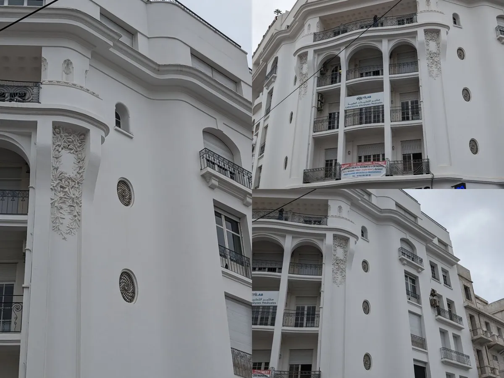

| Building | Date | Architects |
| --- | --- | --- |
| Marché Central | 1917 | Pierre Bousquet | 
| Martinet Building | 1919 | Pierre Bousquet | 

### Poste Office & Casablanca Stock exchange | Maroc-Soir 
On the left side, you'll find a beautiful building connecting two headquarters, one for the post office and the other for the **Casablanca Stock Exchange building** (now the Casablanca Settat Chamber of Commerce, Industry, and Services). The building presents a Neo-Moorish style using Qarmoud on the roof.

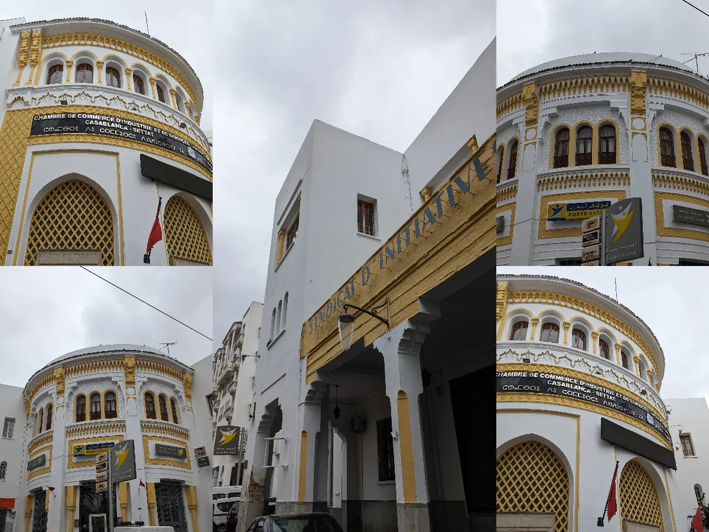

A few steps forward is another beautiful Neo-Moorish showcase, the **Maroc-Soir building** designed by *Marius Boyer* in 1924.

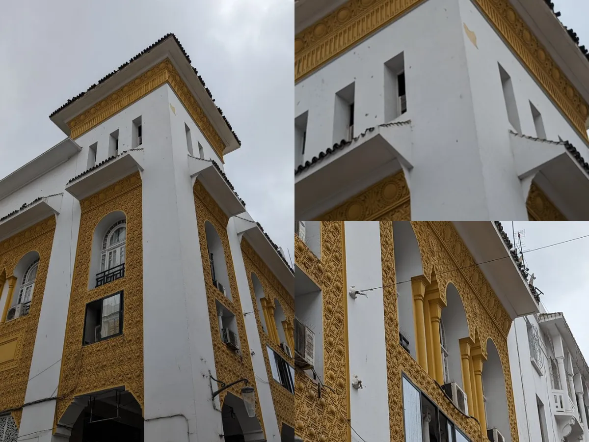

### Immeuble Gallinari | Ritz Cinema | Rialto Cinema 
On your right, you'll come across one of the most memorable facades on the boulevard, the **Gallinari Building**, topped with the head of *Dionysus*, the Greek God of Wine.

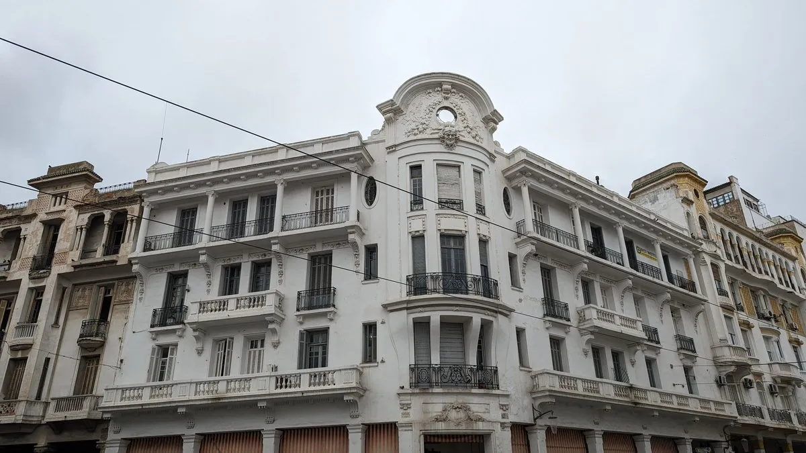

:::note[💡 Casablanca, the city of Leisure]
As Casablanca expanded, the demand for entertainment grew as well. The city began offering more and more intertainment for its residents, with [cinemas](https://www.zupimages.net/viewer.php?id=18/06/ksb0.jpg) opening on nearly every neighood. Some notable theaters included the Rialto, Ritz, Lutetia, Empire, ABC, Imperial and Vox (which has since been destroyed) in Sidi Belyout. Verdun, Opera, Empire in Anfa. Kawakib, Monte-Carlo, and others in other neighborhoods.

Moreover, several sports facilities were built, such as La Casablancaise for physical education, the [Velodrome](https://fr.wikipedia.org/wiki/V%C3%A9lodrome_de_Casablanca) which contained tracks for bikes and other for [Dogs](https://fr.le360.ma/lifestyle/il-etait-une-fois-le-cynodrome-de-casablanca-une-exception-africaine-176593/), a [Bullfighting arena](https://fr.le360.ma/lifestyle/il-etait-une-fois-les-arenes-de-casablanca-temple-de-la-tauromachie-du-rock-et-des-courses-de-stock-202354/), and the [Orthlieb Pool](https://en.wikipedia.org/wiki/Orthlieb_Pool) which was considered as the world's largest swimming pool. This pool was later replaced by the impressive Hassan II Mosque.

In addition to the cinemas and stadiums, numerous shops were established around 16th November Square and along Bd de La Gare (Mohammed V street), catering to the growing shopping needs of the population.
:::

After appreciating the building's facade, and confirming if it's *Dionysus*, turn left onto Rue Mohammed Quorri where you'll find two of Casablanca's most popular cinemas, **Rialto** and **Ritz Cinema**.

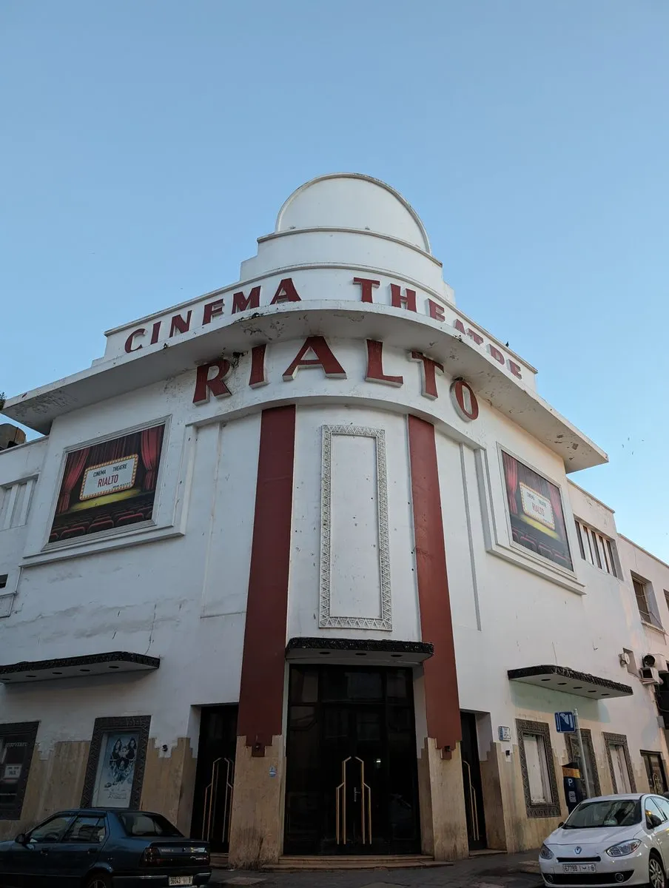

| Building | Date | Architects |
| --- | --- | --- |
| Gallinari Building | 1924 | Elias & Joseph Suraqui | 
| Rialto Cinema | 1929 | Pierre Jabin | 
| Ritz Cinema | - | - | 

### Immeuble Credit du Maroc 
Return to Mohammed V Street. One block down, on your left, you'll find the **Credit du Maroc Building** (previously the Credit Lyonnais Building), which stands out with its functionalist architectural style leaning towards brutalism.

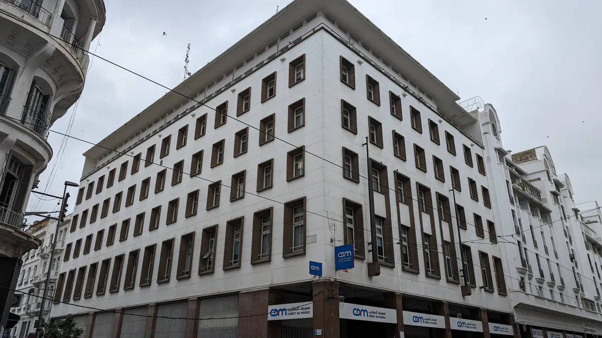

| Building | Date | Architects |
| --- | --- | --- |
| Credit du Maroc Building | 1950 | Edmond Brion | 

### Immeuble Banon & Cinemas
On your right, there is the Banon Building from the late twenties, known for housing two cinemas, **Empire** and **ABC**, some of the oldest cinemas in the city, which are both closed today.

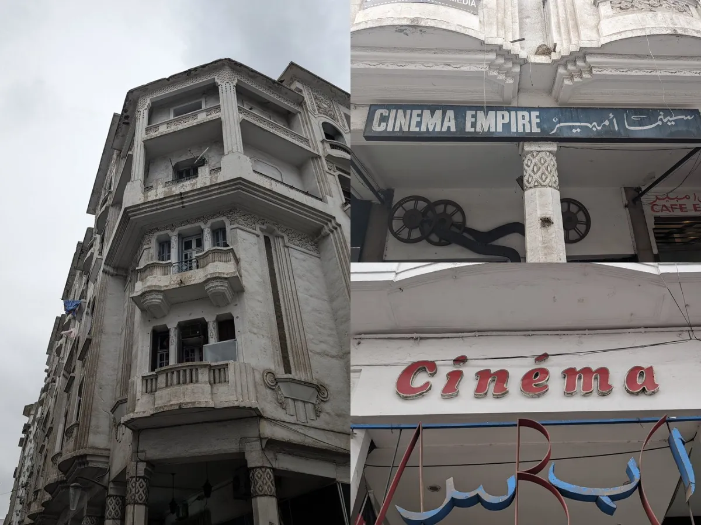

| Building | Date | Architects |
| --- | --- | --- |
| Banon Building | 1929 | Aldo Manassi | 
| Empire Cinema | 1928 | Aldo Manassi | 
| ABC Cinema | 1927 | Aldo Manassi | 

### Immeuble Glaoui 
We've reached the end of Mohammed V Boulevard. Here you'll find the **Glaoui Building**, one of the street's most impressive and beautiful buildings, designed by *Marius Boyer* & *Jean Balois* for the renowned Pacha of Marrakech, **Thami Glaoui**.

:::note[💡 Casablanca's unique Passages (Hallways)]
The concept of passages in Casablanca started with the construction of significant commercial arcades, the first being built for the Glaoui, Pasha of Marrakech, by architect Marius Boyer in 1928. These passages were unique architectural innovations, first seen in Casablanca, combining elements from Moroccan Kissaria markets and European hallways like those on the Champs-Élysées in Paris. 

Notable examples include Passage Sumica, designed in an Art Deco style, and Passage Tazi, featuring a large rotunda with glass-covered pavements and luxurious Zellij finishes. These passages represented a blend of traditional Moroccan and European influences, enhancing the commercial and social life of the city.

💡 The word Kissaria has its origins in Morocco's Idrissid period. It comes from "Kaissar," which refers to Caesar. These covered marketplaces got this name because they were frequented by the upper class, people of high status. -- Credits to [Casapocket](https://www.instagram.com/casapocket.officiel/)
:::

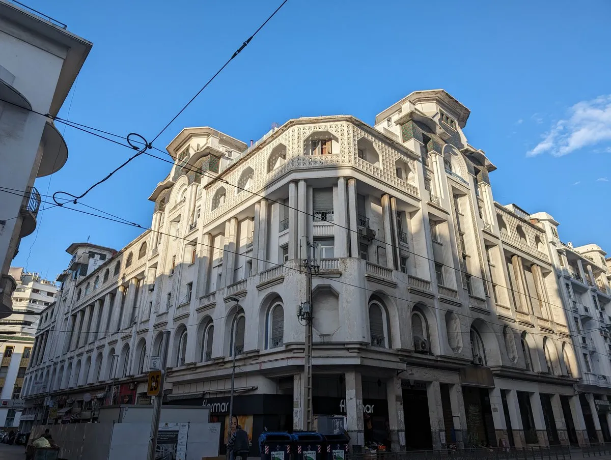

| Building | Date | Architects |
| --- | --- | --- |
| Glaoui Building | 1927 | Marius Boyer & Jean Balois | 

### Immeuble Grand Bon Marché 
Let's backtrack a bit to the other side of the street. You'll find the Cubic-style **Trianon Building** on the corner by *Marcel Desmet*, alongside the **Grand Bon Marché building**, situated above the **Sumica** and **Grand-Socco passages**, with three bays, each topped with a sloped roof decorated with refined mosaic tiles.

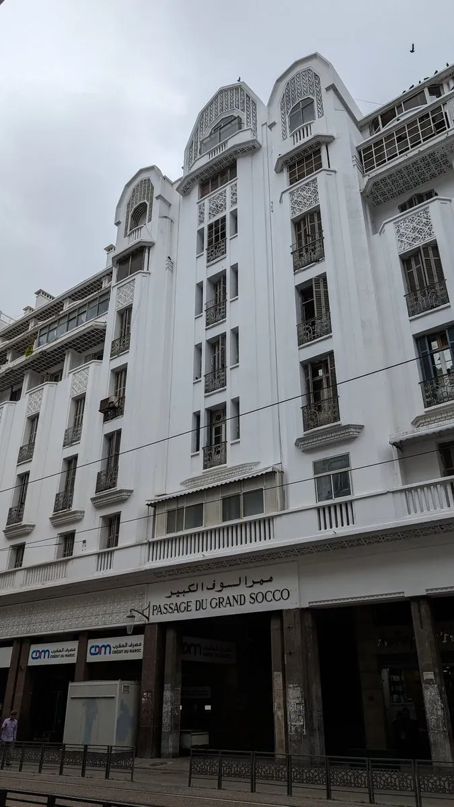

| Building | Date | Architects |
| --- | --- | --- |
| Trianon Building | 1935 | Marcel Desmet | 
| Grand Bon Marché Building | 1932 | Edmon Brion, Auguste Cadet, Marcel Desmet | 

## The two squares
### 16th November square 
Head to **16th November Square**, either via Rue Artiside Briand or through the shortcut of the **Grand Socco Passage**. Once there, go to the 16th November Statue in the center of the square. Let's start from your right. First, you'll see one of the most beautiful yet underrated buildings in Casablanca, the **Bendahan Building** by *Edmon Brion*. 

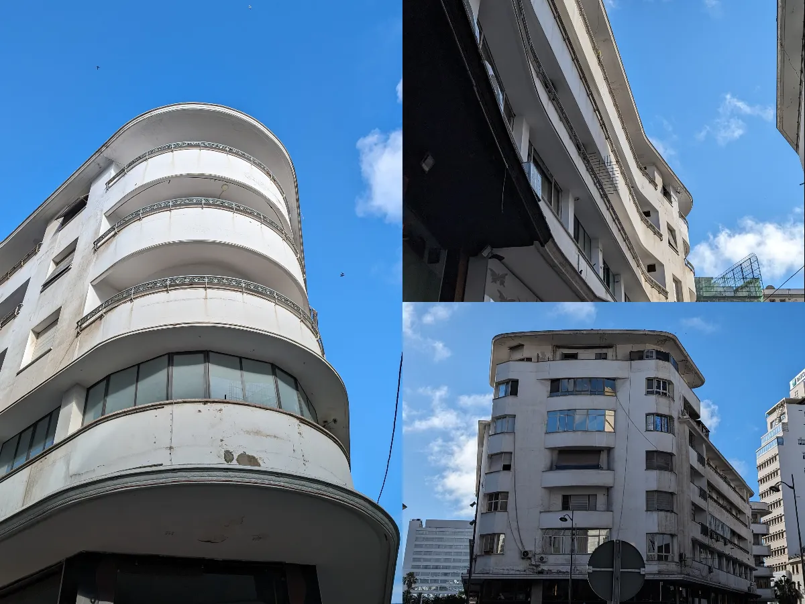

A little to the right, you'll find the **Banque Populaire Building**, which was previously the headquarters of the British West African Bank. Although the facade has changed, some original touches remain, especially around the doors and windows. 

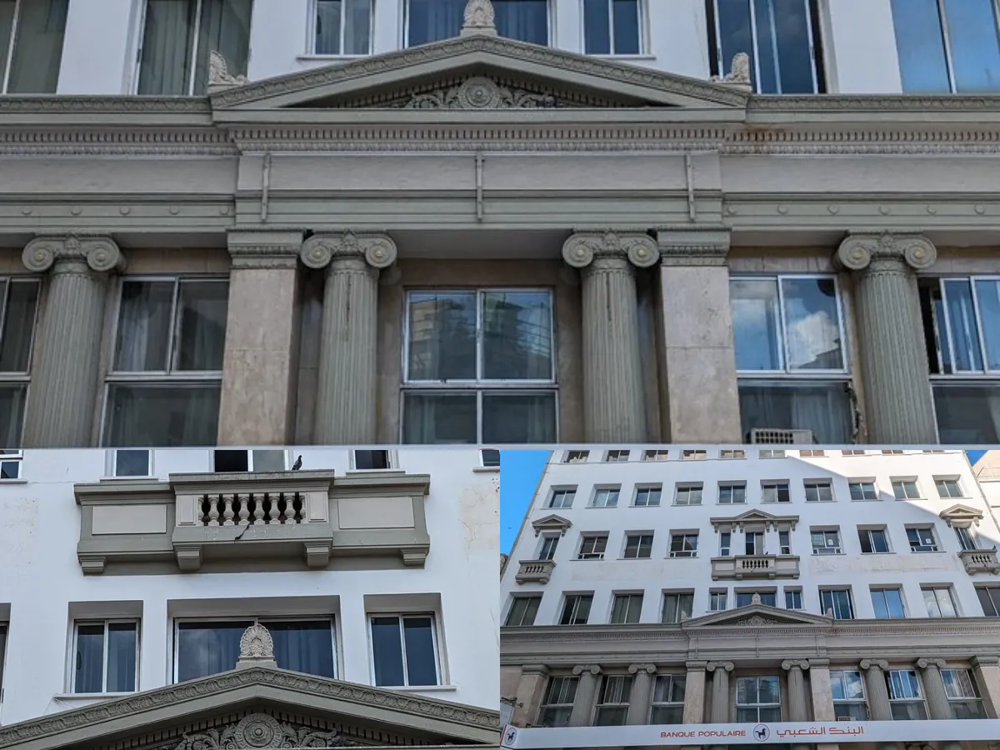

:::note[💡 The businessmen of Casablanca]
In addition to the Jewish and French businessmen drawn to the emerging city of Casablanca, several prominent Moroccan businessmen and politicians also established their businesses there or relocated to the city. 

Among the most notable were the port director **Ahmed Touzani**, **Mohammed Zemmouri** know for importing tea, the founder of Wydad Athletic Club **Mohammed Benjelloun**, and later figures such as **Thami El Glaoui** the Pasha of Marrakech, **Omar Tazi** the Pasha of Casablanca, **Abdelkarim Ben Msik** and many others.

:::

Next, in a clockwise direction, is the **Baille Building**, which will be behind you if you're facing the Bendahan. The Baille Building is known for hosting one of the oldest cafes in Casablanca, **Cafe la Chope**. Continuing clockwise is the **Bennarosh Building**, with its unique facade featuring colored poles under the balconies. 

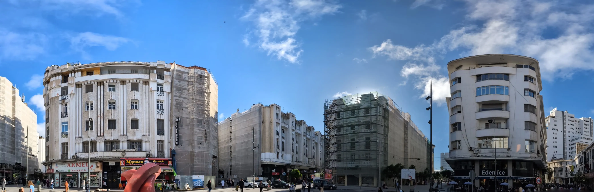

Last but not least you'll find the **Tazi Building**, designed by *Aldo Manassi* in 1931 for the Pacha of Casablanca, *Omar Tazi*.

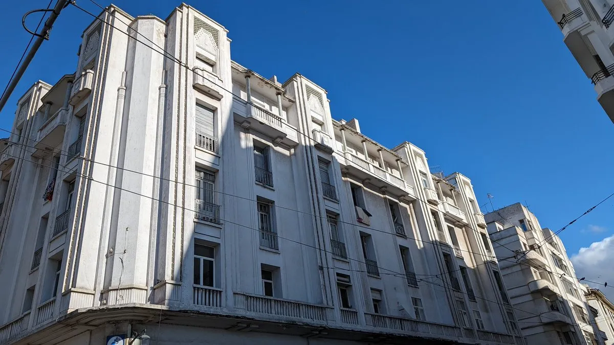

| Building | Date | Architects |
| --- | --- | --- |
| Statue 16th November | 1980 | Abdelhaq Sijelmassi |
| Bendahan Building | 1935 | Edmond Brion | 
| Banque Populaire Building | 1918 | Georges Virmot | 
| Baille Building | 1931 | Auguste Cadet & Edmond Brion | 
| Bennarosh Building | 1932 | Aldo Manassi | 
| Tazi Building | 1931 | Aldo Manassi | 

### Road to United Nations
Continue on the small street to the right of the Tazi Building on Rue Ouhoud towards **United Nations Square**. Once there, you can admire the beauty of the Tazi Building or do some shopping in **Passage Tazi**. Then, continue in the direction of the Medina.

:::note[💡 On the United nations square]
United Nations Square is considered by many Casaouis to be the heart of the city. Originally known as France Square, it was once home to the Sokko Market, one of the first markets outside the city walls, as well as several Jewish residences. 

After extensive negotiations, the Protectorate managed to demolish the existing structures and convert the area into an open square. Since then, United Nations Square has held a special place in the hearts of Casaouis, remaining a lively and central spot where significant events occur and where locals gather to celebrate their city.

> When I arrive at the Place de France, very long and quite narrow, I find the noise and triviality, an uproar of creaking trams, newspaper vendors shouting, carts, in a setting of ugly hotels, branches of Parisian stores, cinema entrances, and brasserie terraces. The bustling crowd there reminds me of my worst Neapolitan impressions. I see greasy, curly-haired, and dark-skinned individuals, with big watch chains crossing their bellies, cigars stuck in their thick lips, who are brokers selling everything, from rabbits, peanuts, women, anything. The little filthy shoe-shiners, the little beggars, are just as annoying as on La Joliette or in the narrow streets of Spain, and the inevitable, cosmopolitan goat-skin traders and dreadful rug merchants have, as everywhere, the air of fake Arabs, even if they are real. -- Les couleurs du Maroc - Camille MAUCLAIR.

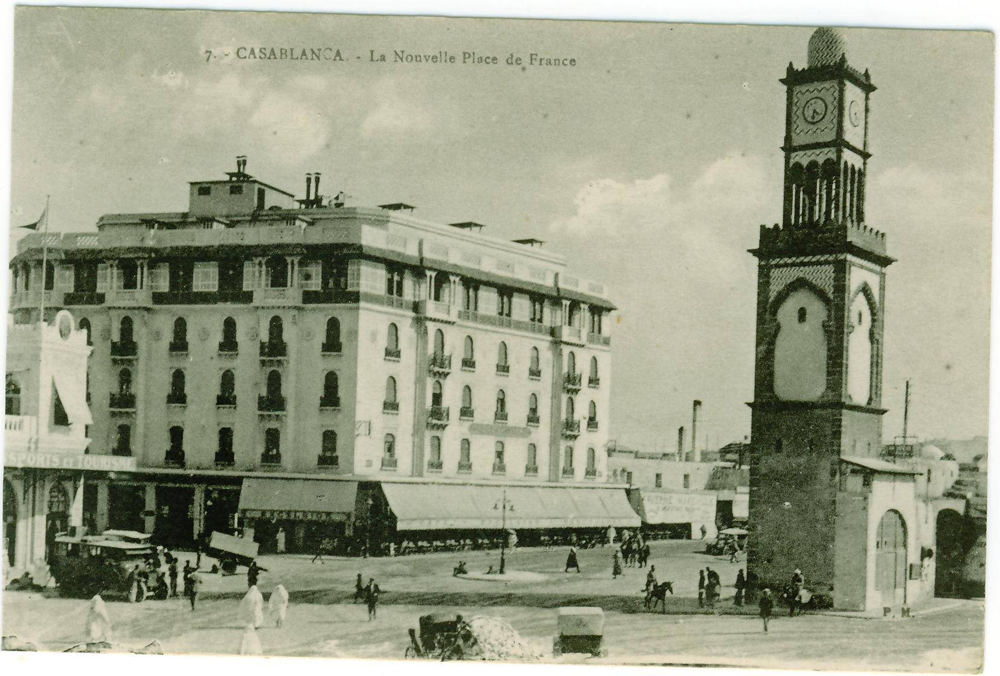
:::

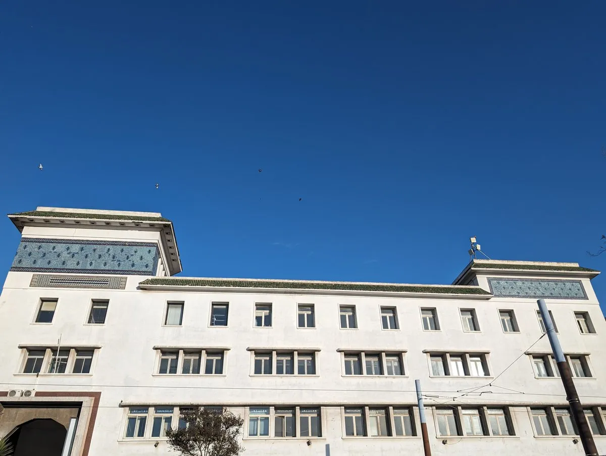

The first building on your right is a Neo-Moorish structure, originally built for the **French-Algerian bank (Compagnie Algérienne)** and later transformed into an Attijari Wafabank branch. In the next block, you'll find the **Socifrance Building**, which adheres more to a minimalist, functionalist architectural style.

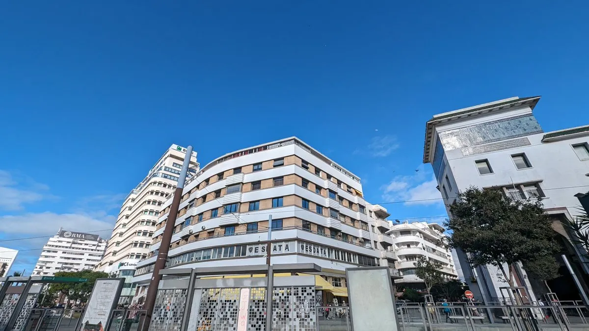

Next, in the same direction, is the relatively new **BMCI Bank headquarters**. Following that is one of the oldest buildings and the oldest hotel in Casablanca outside the Medina walls, the **Excelsior Palace Hotel**.

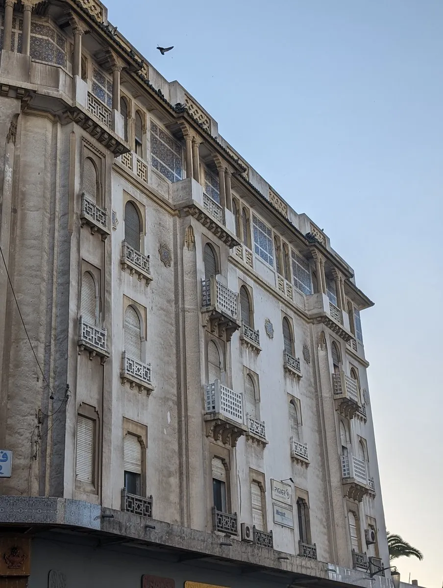

On the opposite side, you'll find the **Hyatt Regency**, a relatively new hotel dating back to the 1970s.

| Building | Date | Architects |
| --- | --- | --- |
| United Nations | 1915 | Henri Prost | 
| Tazi Building | 1931 | Aldo Manassi | 
| Attijari Wafabank Building | 1928 | Henri Prost & Antoine Marchisio | 
| Socifrance Building | 1935 | Erwin Hinnen | 
| BMCI Building | 1950 | Alexandre Courtois | 
| Excelsior Palace Hotel | 1916 | Hippolyte-Joseph Delaporte | 
| Hyatt Regency | 1970s | - | 

### Finish in the clock tower
In the middle of the western part of United Nations Square is the well-known **Globe Dome**, built in 1970 with the underground pedestrian passage, both designed by *Jean-Francois Zevaco* and renovated in the early 2020s. Next, on Bd des FARs, you'll see the famous Clock Tower, which was destroyed in the 1940s and rebuilt in 1994.

:::note[💡 The Clock towers in Casablanca]
In the early 1990s, Casaoui people, along with foreign communities in Casablanca, lived according to various time standards, including British time, Spanish navy time, and Moroccan time measured from dawn to sunset. 

To unify the city's time, Major Dessigny constructed a clock tower near Bab El Kebir. This approach was repeated with additional clock towers in Mohammed V Square and at the Casa Voyageurs train station.
:::

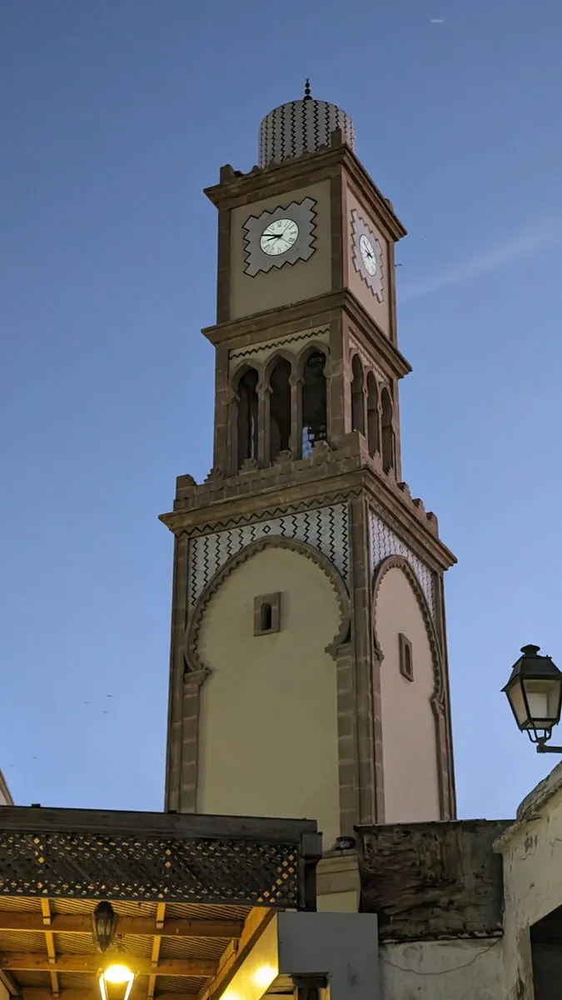

Finally, we conclude with one of the most inspiring buildings in the United Nations Square, the *Moretti-Milone Building*, constructed in 1934.

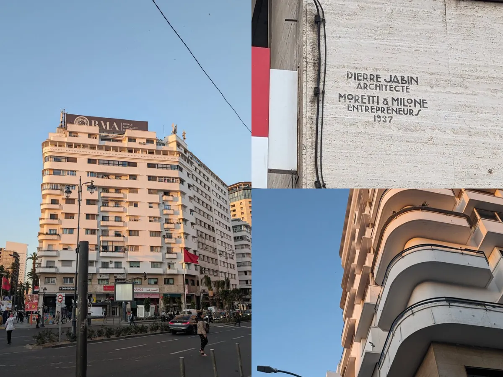

| Building | Date | Architects |
| --- | --- | --- |
| Zevaco Globe Dome | 1970 | Jean-François Zevaco | 
| The Clock Tower | 1908 (1994) | Génie Bouillot | 
| Moretti-Milone Building | 1934 | Pierre Jabin | 

:::note[💡 Casamémoire]
Casamemoire is a non-profit organization focused on promoting and protecting Casablanca's 20th-century architecture.

The organization was founded in 1995 by Jacqueline Alluchon and other Casaoui architects following the demolition of Villa Mokri. Since then, they have worked diligently to promote Casablanca's heritage and raise awareness about the city's architectural significance through [various events](https://www.instagram.com/casamemoire.officiel/) and [online initiatives](https://unpcasamemoire.com/).

They have also led efforts to register many of Casablanca's buildings as national material heritage and are working towards getting Casablanca recognized as a UNESCO World Heritage site.
:::

import MiniMap from '../../components/MiniMap.astro';

<MiniMap mapId="casablanca-mohammed-v-walk" />

Cheers 🎉🎉
