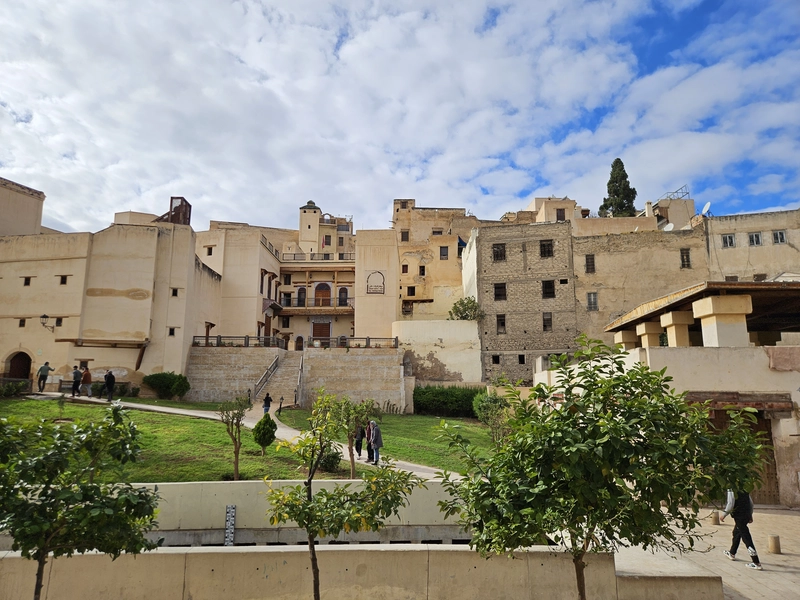
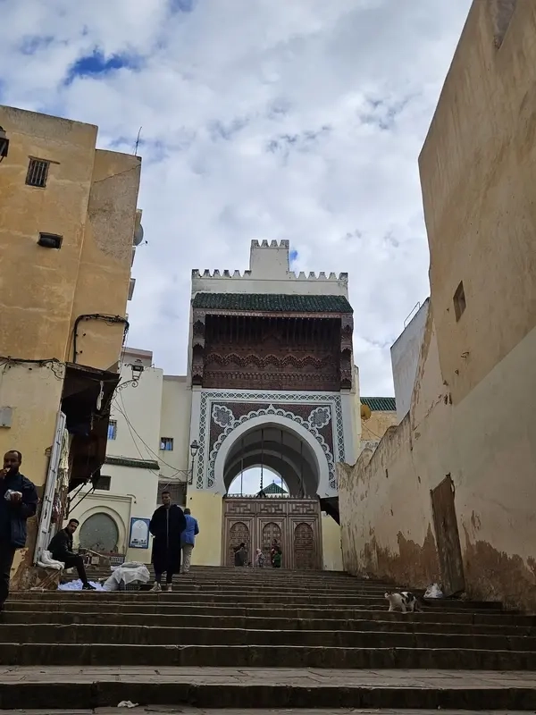
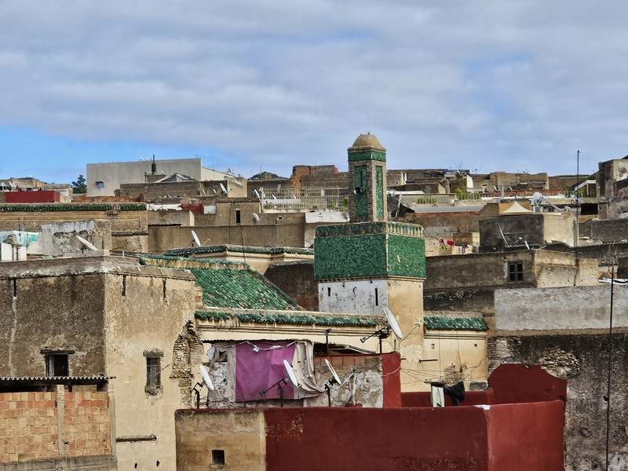
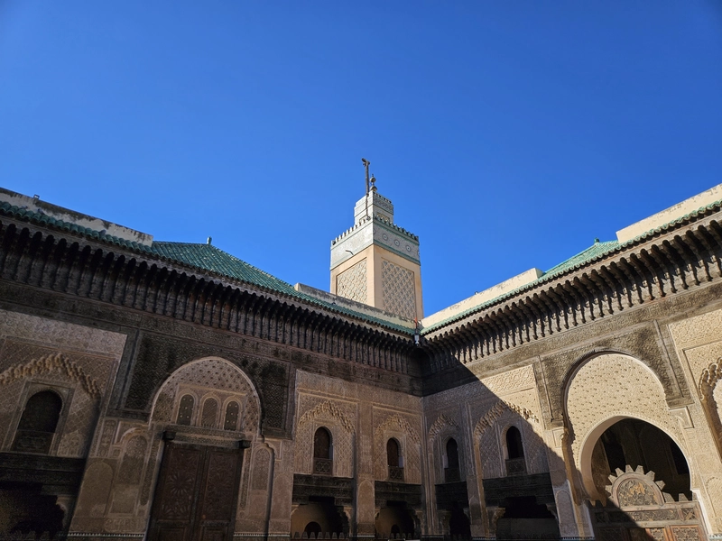
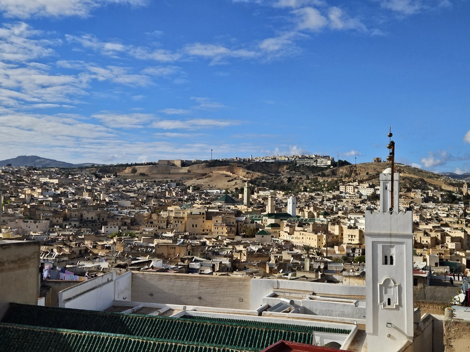

The exploration journey to determine the ideal location for his capital following Volubilis (Walili), Moulay Idriss II ultimately chose to establish it on the banks of the Fez River. He initiated the construction of a city on the right bank of the river, with the majority of its populace consisting of Andalusians. Subsequently, he ventured to the opposite bank to establish another city, predominantly populated by Arab refugees from Kairouan. This set the stage for the division of Fez into two distinct but symmetric areas: one inhabited by Andalusians and the other by Kairouanis, with the Fez River flowing between them.

# Story 1: The First Mosques of the City

Prior to constructing an Islamic city, the primary consideration is the construction of the grand mosque. Moulay Idriss's initial plans for the city of Fez included two significant mosques, one on each bank:

- The Anwar Mosque (also known as Ashyakh): Situated in the Andalusian area, it was the first mosque to be erected and used for Jumu'aa prayers. Today, only remnants of its walls and a few components remain, with the area in front of it serving as the cemetery of the Qaytouni Shorfah.
- The Shorafah Mosque: Located in the vicinity of the Kairouanis, it was built once the Kairouanis' section of the city was established, and it began hosting Jumu'aa prayers for the Kairouan Bank.

# Story 2: The Sisters

Fez is growing rapidly, and with it the need for larger mosques and educational institutions where people could learn the Quran and study its sciences grew as well. Here begins the story of the oldest two universities, and one of the most beautiful stories of competition between sisters in history:

- Al-Qarawiyyin Mosque: Fatima al-Fihriya donates her heritage money to build a large mosque (and university) in the Kairouan area. This mosque will soon replace the Shorafah mosque for Friday prayers, and be one of the most prestigious universities in the West. And today it is considered as one of the oldest university in the world and maybe the oldest still running to this day.
- Al-Andalus Mosque: In the same way and at almost the same time, Mariam, Fatima's sister, sponsored a large mosque in the Andalusian area, which will become a center for knowledge and the new university of the Andalusian Fassi people.

As Fez experiences rapid growth, the demand for larger mosques and educational institutions where individuals can study the Quran and its sciences also rises. Thus begins the tale of the oldest two universities, and one of the most captivating stories of sibling rivalry in history:

- Al-Qarawiyyin Mosque: Fatima al-Fihriya generously contributes her inheritance to construct a sizable mosque (alongside a university) in the Kairouan area. This mosque will soon supplant the Shorafah mosque for Friday prayers and emerge as one of the most esteemed universities in the Western world. Today, it holds the distinction of being one of the oldest universities globally, perhaps even the oldest continuously operational one.
- Al-Andalus Mosque: Similarly, Mariam, Fatima's sister, lends her support to establish a grand mosque in the Andalusian area, around the same period. This mosque will serve as a hub for knowledge and become the new university for the Andalusian Fassi community.

# Story 3: The Enemy Brothers

Many people (and school curriculums) attribute the rule of Fez directly from the Idrissids to the Almoravids. This is not entirely true, as Fez would be ruled by Amazigh tribes of great importance notably Maghraouwa of Zenata tribe. One of the greatest Maghraoui rulers of Fez was Donas ibn Hammama al-Maghrawi. When he died, he left his sons. the older Fetouh bin Donas, who would settle in the Andalusian area, and Aagiza Bin Donas, who would rebel against his brother's rule and establish his rule from the Kairouan area. This would lead to one of the fiercest wars between the enemy brothers, leaving a lasting impact on the city. The war between the brother enemies are still remembered by Fassi people by naming two gates from both sides of the city on their names, which are today among the most important gates of the city. 

- Bab Ftouh: One of the Andalusian side gates.
- Bab Guissa: One of the Kairaouniyan side gates (a distortion of Aguiza) 

Many individuals, as well as educational curricula, often assume Fez's governance went directly from the Idrissids to the Almoravids. However, this oversimplification overlooks the crucial role played by prominent Amazigh tribes, notably the Maghraouwa of the Zenata tribe. 

Among the most influential Maghraoui rulers of Fez was Donas ibn Hammama al-Maghrawi. Upon his passing, he left behind his sons: the elder, Fetouh Bin Donas, who established himself in the Andalusian area, and Aagiza Bin Donas, who rebelled against his brother's authority and established his rule in the Kairouan area. 

This familial discord ignited one of the most intense wars between the sibling rivals, leaving an long last mark on the city's history. The conflict between the warring brothers is still commemorated by the Fassi people through the naming of two gates after them, which today stand as prominent landmarks in the city:

- Bab Ftouh: Located on the Andalusian side.
- Bab Guissa: Found on the Kairouan side (a variation of Aguiza).

# Story 4: The Era of Enlightenment

Without doubt, the Marinid era, particularly the reign of Abu al-Hasan and his son Abu Inan, marked one of the most significant epochs in Fez's history. During this time, the city transformed into a global hub of scientific inquiry and a magnet for scholars from every corner of the globe, regardless of their discipline (be it mathematics, geography, jurisprudence, astronomy, and so forth). 

Despite the presence of Al-Qarawiyyin University and the Al-Andalus Quranic School, the demand for additional educational institutions capable of accommodating students from around the world became pressing. It was in response to this need that Sultan Abu al-Hasan ordered the construction of schools affiliated with these major central institutions. Following a symmetrical design approach, Abu Al Hassan planned:

- The Attarine School and the Seffarine School in the Kairouan area were established to complement Al-Qarawiyyin School.
- The Sahrij School and the Sabaiyyin School in the Andalusian area were established to support the Al-Andalus Quranic School.

# Story 5: The Guardians of Morocco

While the Saadi, also known as Zaidani, dynasty originated from the southern regions of Zagora and later Taroudant, they governed Morocco from their capital, Marrakech. However, they recognized the importance of securing the support of the people of Fez for effective rule over the kingdom. That's why Ahmed al-Mansur al-Dhahabi commissioned the construction of two military towers modeled after portuguese forts, just outside the walls of the Fez Medina. 

Positioned atop two opposing hills, These towers were built to keep an eye on the city for both outside enemies and inside troublemakers. Today, these twin towers stand as some of the most impressive landmarks in Fez:

- The Southern Tower: positioned to overlook the Andalusian area. Today it is no longer in service, but it is guarded by national security guard.
- The Northern Tower: situated to oversee the Kairouan area. Today it is home of a the national Museum of Weaponry.

As we conclude our stories, Fez's narrative serves as a timeless testament to the beauty of symmetry, evident in its architecture, culture, and the tales of its people.

# The Map
<iframe src="https://www.google.com/maps/d/u/0/embed?mid=1odlE5npWCHuNfalw7_zzl_Vv-RhXrS8&ehbc=2E312F" width="100%" height="480"></iframe>
