Morocco has many stunning sites that look even more impressive from above. Whether seen in person or on Google Maps, these views reveal the country's rich history and diverse landscapes.

## Majestic Mosques

Morocco's mosques are breathtaking from the sky. The tall Almohad minarets in Rabat, Salé, and Marrakech highlight the country's Islamic heritage.

In Fez, the tiled roofs of Al Qaraouiyin and Al Andalus mosques add to the city's charm.

The most striking of all is the Hassan II Mosque in Casablanca, the largest in North Africa, best appreciated from above.

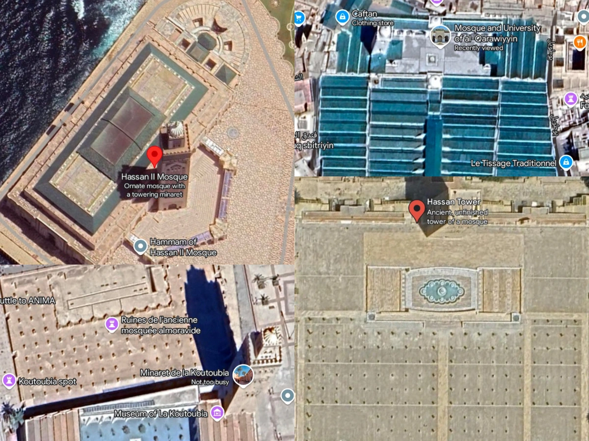

## The Meandering Draa River

The [Draa River](https://en.wikipedia.org/wiki/Draa_River), Morocco's longest, has been vital for centuries. It flows from the High Atlas Mountains to the Sahara, briefly touches Algeria, then heads to the Atlantic near Tan-Tan. 

Seen from above, it weaves through lush oases and dry deserts, showing Morocco's dramatic landscapes.

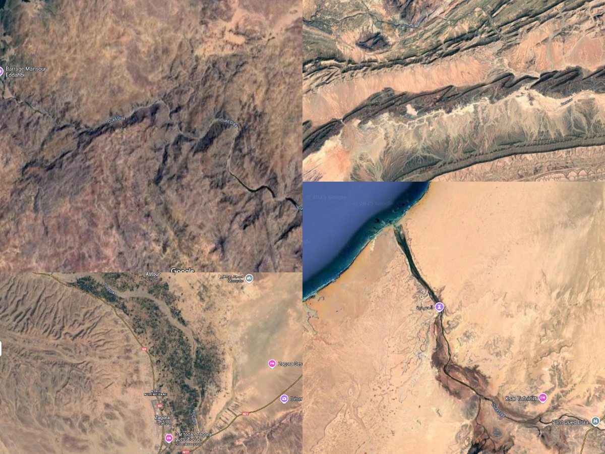

## The Unfinished Trans-Saharan Railway

France once planned a very ambitious [railway from Niger to the Mediterranean](https://en.wikipedia.org/wiki/Mediterranean%E2%80%93Niger_Railway), passing through Béchar, Bouarfa, Tendrara, Oujda, and Oran.

Though never completed, remnants like tracks in Oujda and abandoned desert stations still exist.

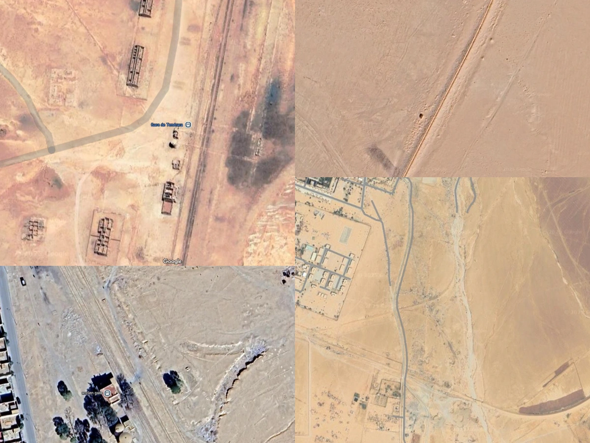

Beyond Bouarfa, the tracks fade, but adventurers can follow them to the Algerian border, revealing the project's struggles against time and nature.

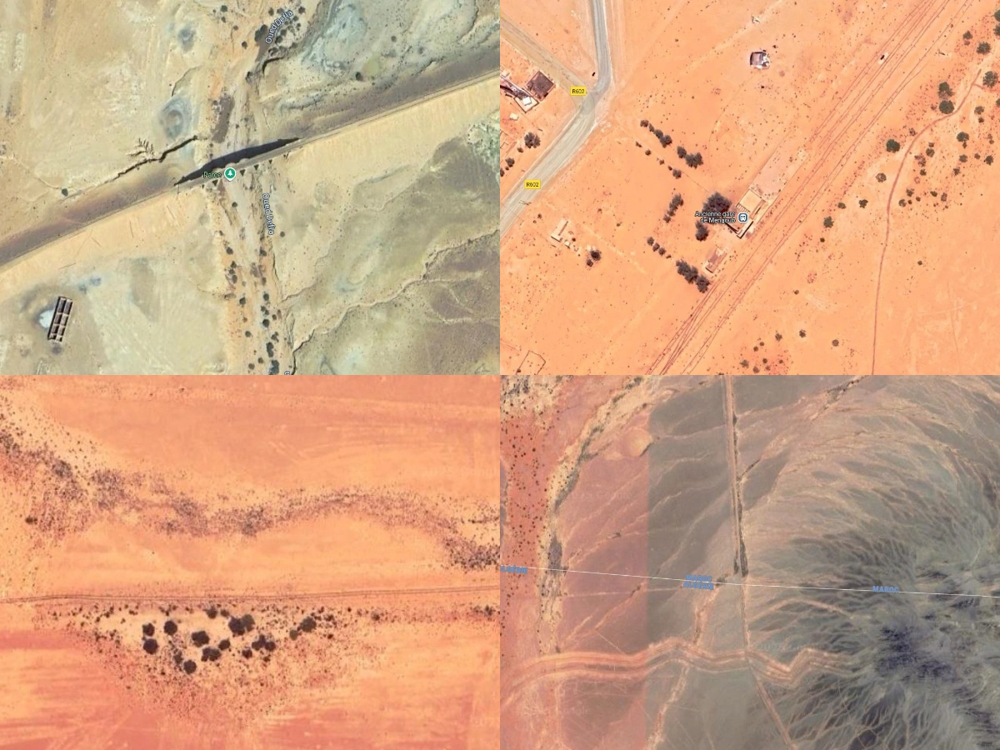

## The Sand Wall

The closed Morocco-Algeria border is a lost chance for tourism and culture. But from above, it reveals an impressive feature: the Sand Wall.

Built in the 1980s to counter the Polisario Front, this vast barrier stretches thousands of kilometers, its winding path seemingly endless.

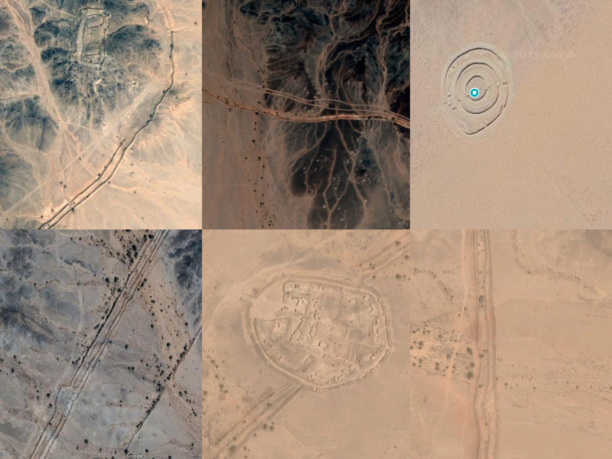

## Nomadic Life in the Eastern Desert

Morocco's eastern desert is home to greatly resilient nomads. Despite the harsh terrain, they farm and herd sheep, supplying top-quality livestock to all Morocco on Eids.

From the sky, their scattered tents highlight life's adaptability in the desert.

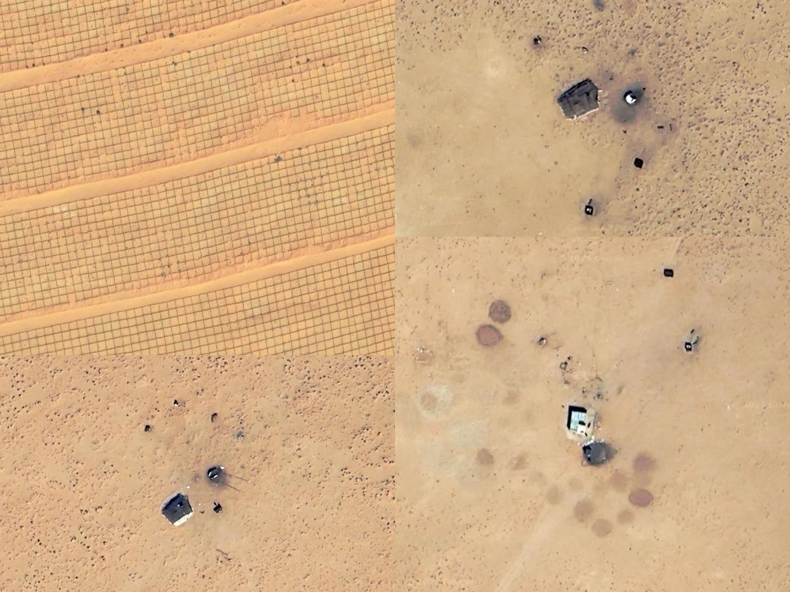

Hidden across the Sahara are strange ponds and lakes, some forming unusual shapes. They provide vital water for wildlife and nomads, their origins and changing sizes adding to their mystery.

Seen from above, they appear like sudden oases in the endless desert.

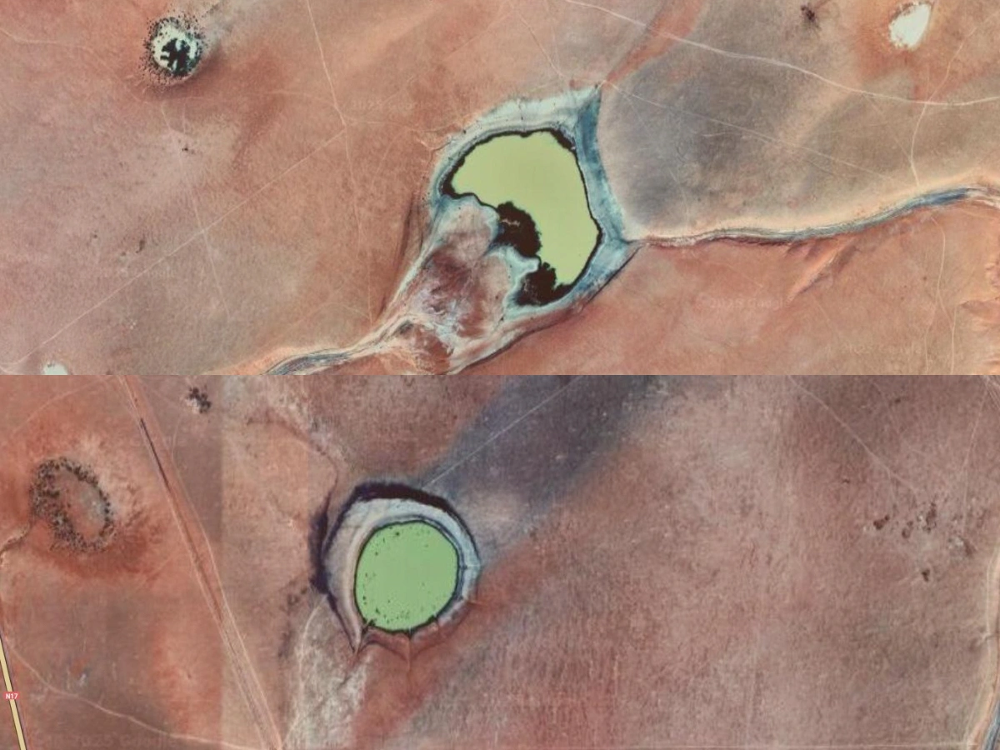

## Hannsjörg Voth's Surreal Structures in Tafilelt

Near the village of Fezna in the Tafilelt region, German architect [Hannsjörg Voth](https://en.wikipedia.org/wiki/Hannsj%C3%B6rg_Voth) constructed three surreal monuments in the heart of the desert: a 53-step staircase, a golden ratio spiral, and the "City of the Orion." 

Set against the barren desert, these monuments blend art, philosophy, and nature.

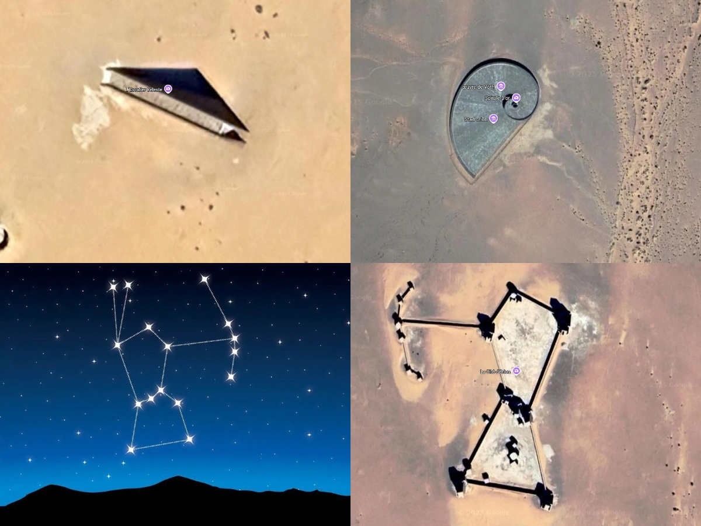

## The Ingenious Khettara Irrigation System

Not far from Hanss's masterpieces, locals built [khettaras](https://www.watermuseums.net/campaigns/valuing-ancient-water-cultures/moroccan-khettaras/) centuries ago. They are underground tunnels that carried water from mountains to oases.

This ancient irrigation system, still visible today, shows how people mastered water management in arid lands.

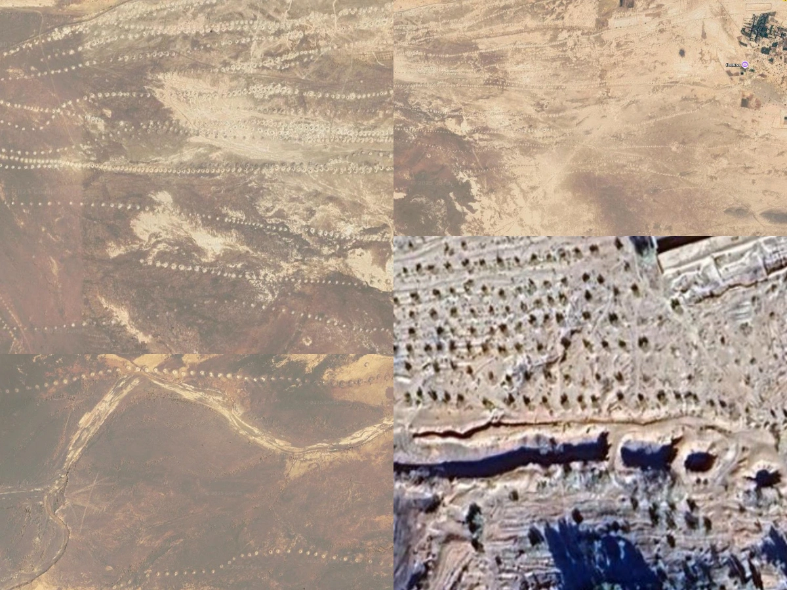

## The "Monkey Fingers"

Ascending towards Tinghir, beyond the lush oases and stunning terrains, lies the "Monkey Fingers" rock formation near Boumalne Dades. 

Resembling giant fingers, these rocks create mesmerizing views, attracting hikers and photographers alike.

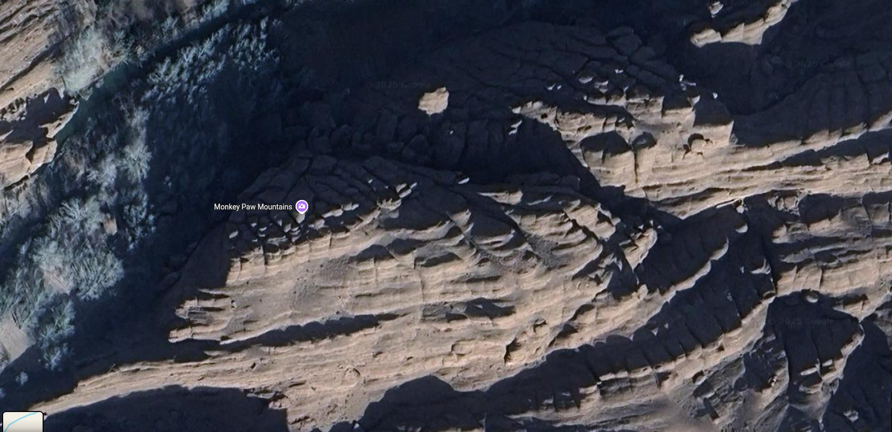

## The Enchanting Kasbahs and Ksours

Morocco's landscape is dotted with [kasbahs](https://en.wikipedia.org/wiki/Kasbah) and ksours, fortified villages that, despite their abundance, never cease to amaze. 

These structures, often constructed with rammed earth, blend seamlessly into their surroundings, offering a glimpse into the country's rich cultural tapestry.

> One such gem is the Tabouassamt Kasbah. Upon entering for the first time, one can't help but be overwhelmed by its architectural beauty and historical significance. 

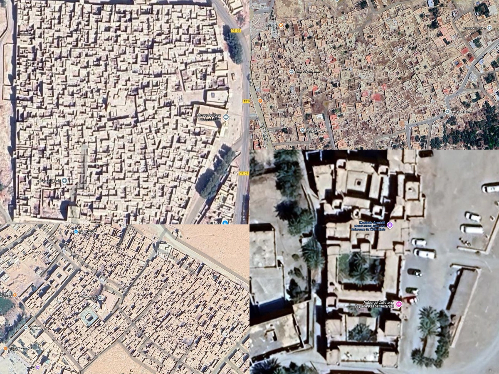

## The Noor Solar Power Station in Ouarzazate

Returning to Ouarzazate, one of the most impressive sights from above is the [Noor Solar Power Station](https://en.wikipedia.org/wiki/Ouarzazate_Solar_Power_Station). 

Comprising various sections, each with distinct designs and operational methods, this massive complex harnesses solar energy on an unprecedented scale. 

> The central tower's mirror is visible on clear days from the Atlas peaks like Toubkal and Mgoun.

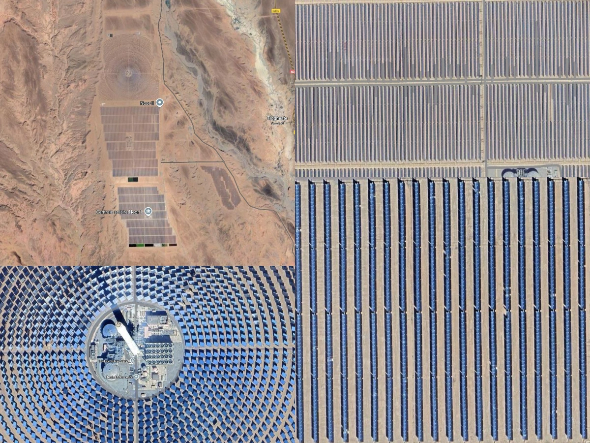

## The Painted Rocks of Tafraoute

In Tafraoute, the landscape is adorned with vibrant [painted rocks](https://explore-agadirsoussmassa.com/en/the-painted-rocks-tafraoute/). 

This artistic endeavor has transformed natural boulders into colorful masterpieces, blending art with nature. 

Tafraoute itself is among Morocco's most picturesque towns, boasting some of the most stunning terrains and natural beauty in the country.

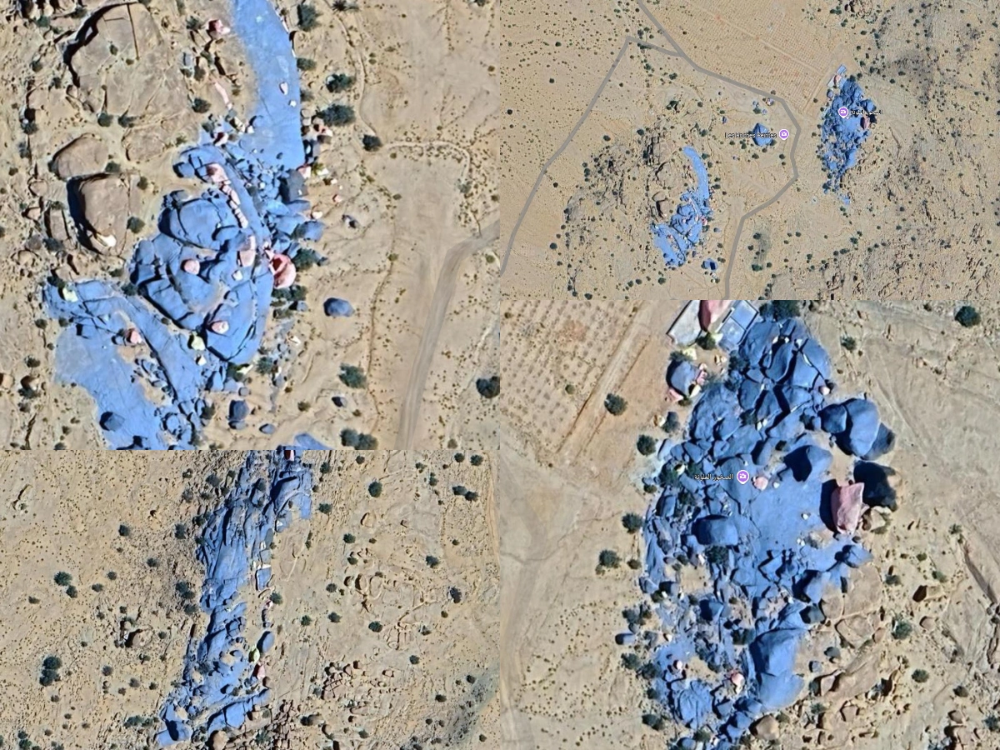

## Casablanca's Unique Housing Developments

Returning to Casablanca, the city features intriguing sights from above, such as mid-20th-century social housing projects like the "Beehive" in Sidi Othmane and the "Spiderweb" in [Ain Chock](https://ainchock.casablancacity.ma/fr/article/873/histoire-dain-chock).

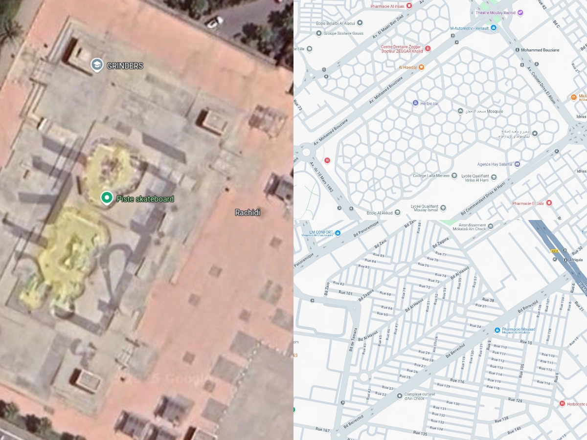

## Rabat's Modern Architectural Landmarks

In the modern Rabat, three remarkable modern landmarks stand out from the sky: the Mohammed VI Tower, the Grand Theatre, and the Mohammed VI Bridge.

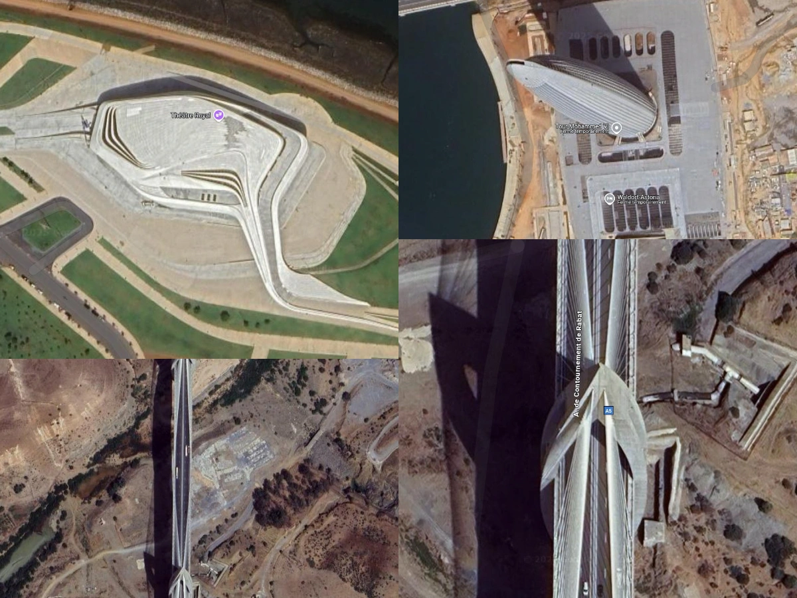

## Ancient Amazigh (Roman) Cities

Morocco is rich in ancient Amazigh (Roman) cities predating history. Some well-known ones include [Volubilis](https://whc.unesco.org/en/list/836/), [Lixus](https://en.wikipedia.org/wiki/Lixus_(ancient_city)), [Chellah](https://www.chellah.site/en/) and [Tamuda](https://en.wikipedia.org/wiki/Tamuda).

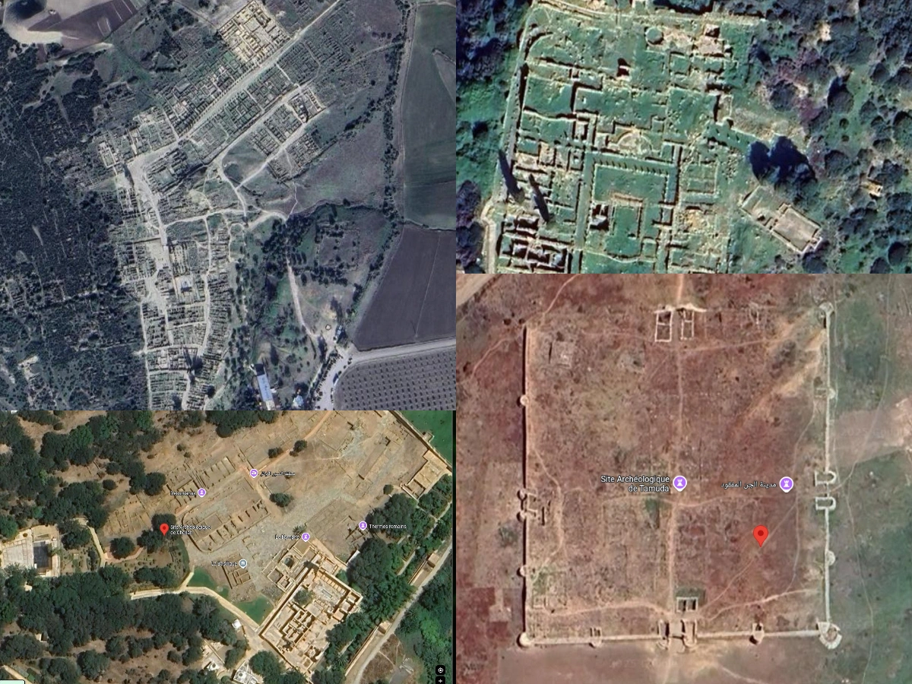

There are lesser-known cities like [Banasa](https://www.visitrabat.com/lieux/la-ville-de-banasa/) and [Thamusida](https://www.visitrabat.com/lieux/la-ville-de-thamusida/) on the Sebou River, [Cotta](https://en.wikipedia.org/wiki/Ancient_Cotta) and [Zilil](https://en.wikipedia.org/wiki/Iulia_Constantia_Zilil) in the north, and many others like Rirha near Sidi Slimane.

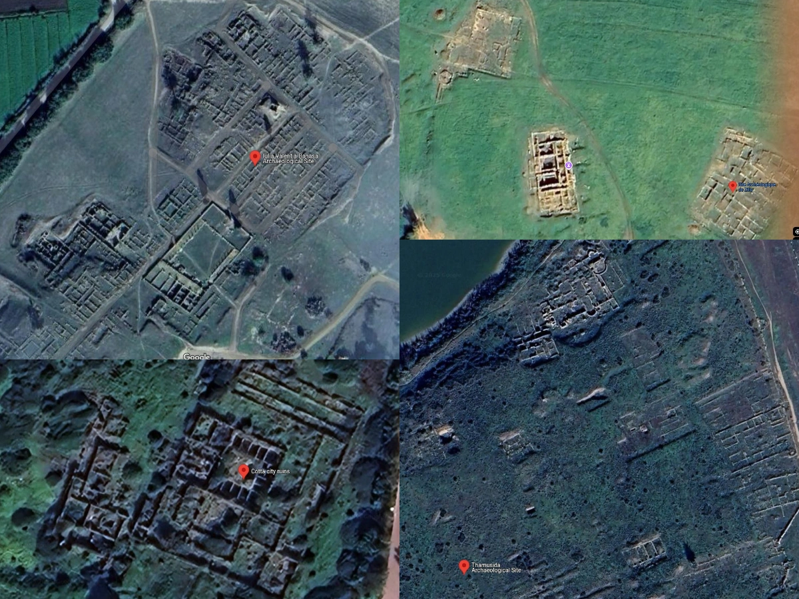

## Prehistoric Tumuli Along Oued Chbika

[Collective tombs](https://www.prehistoire-du-maroc.com/les-tumuli/index.html) from prehistoric times are scattered along the Oued Chbika.

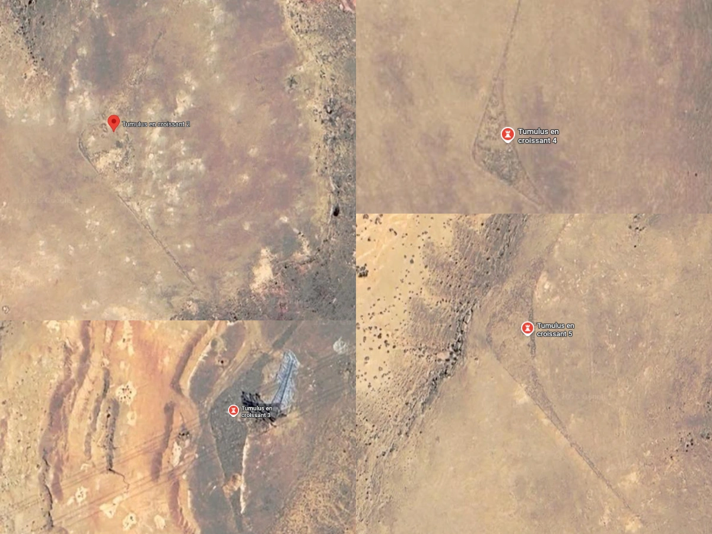

## The Phosphate Belt of Bou Craa

When discussing OCP, we often think of Khouribga, Ben Guerir, or even Jorf Lasfar. However, OCP also operates in [Bou Craa](https://en.wikipedia.org/wiki/Bou_Craa). A remarkable feature is the long conveyor belt transporting phosphate over kilometers to the port near Laayoune.

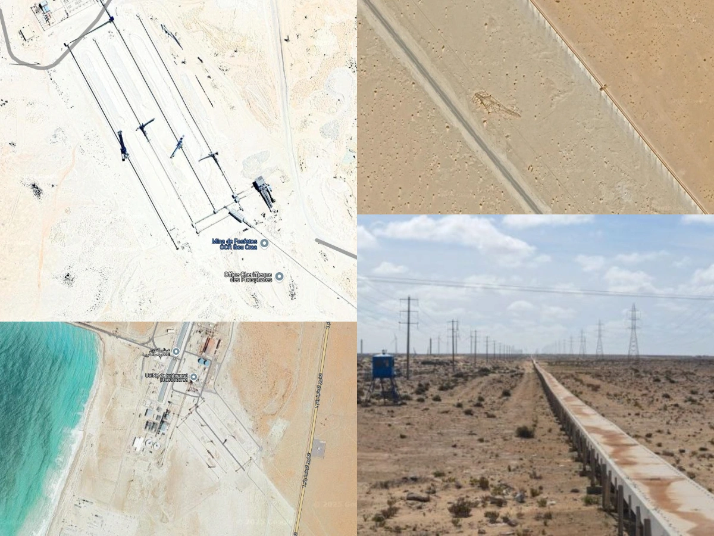

## Mzoura Cromlech

Cromlechs have long fascinated people worldwide, shrouded in mystery and raising many questions. 

While the most famous ones are in Europe, the [Mzoura Cromlech](https://en.wikipedia.org/wiki/Msoura) in northern Morocco, near Assilah, stands as a testament to the country's rich prehistoric past.

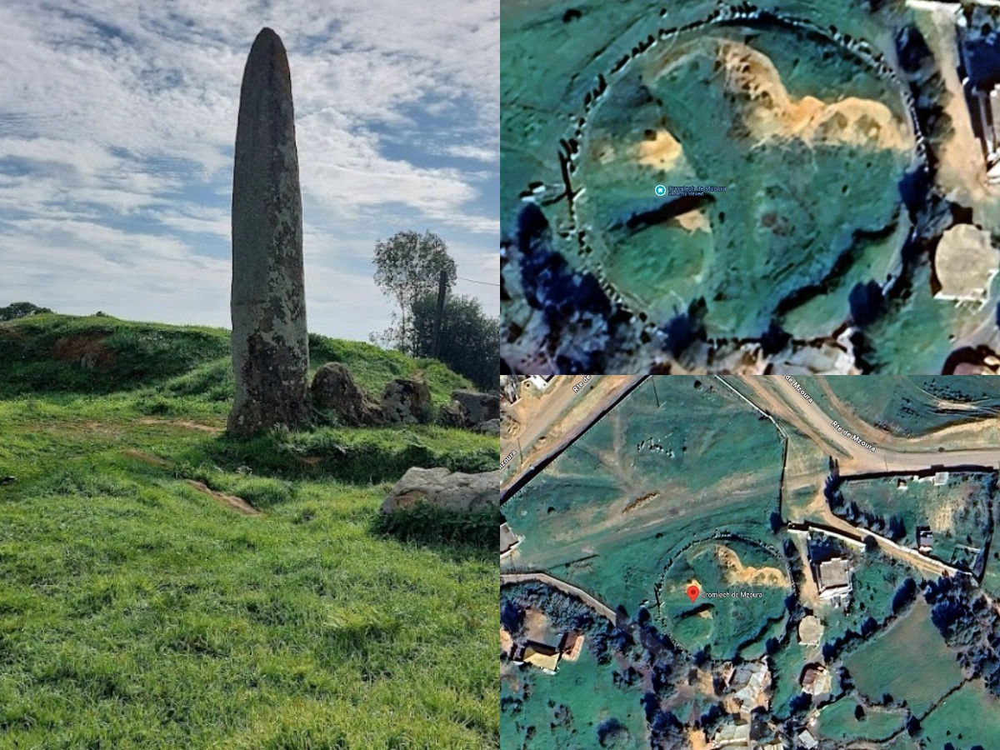

This is just the tip of the iceberg Morocco still holds many hidden secrets and fascinating sights waiting to be discovered.

## The Map

Here is a map with all the places located in the article

<iframe src="https://www.google.com/maps/d/u/0/embed?mid=1BBuySb2hkWNUzHSkm3xUlIoAog_1Cbo&ehbc=2E312F" width="100%" height="480"></iframe>

Cheers 🎉🎉
