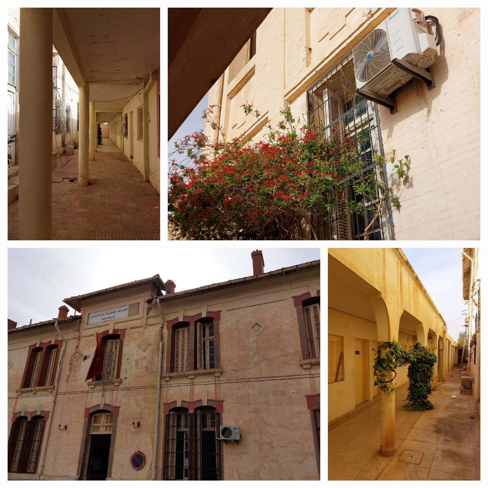
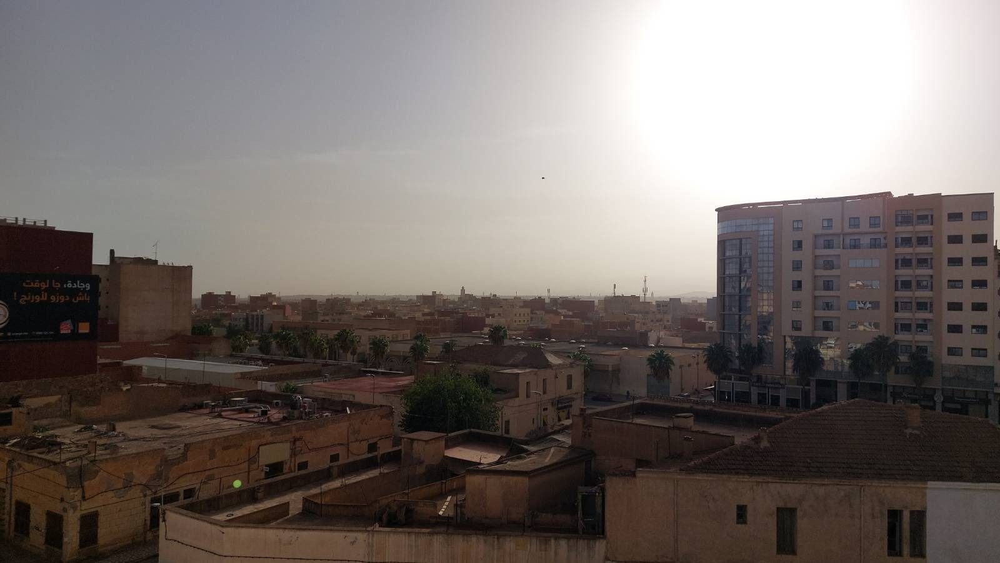
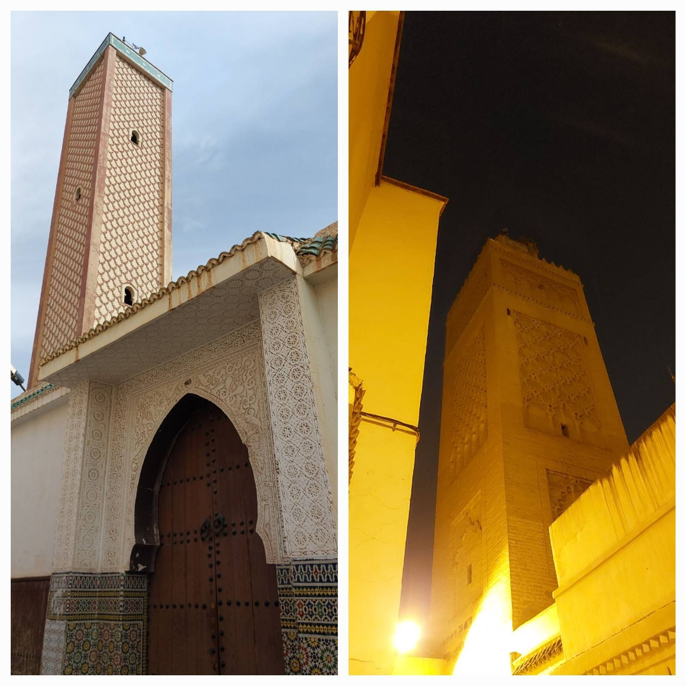
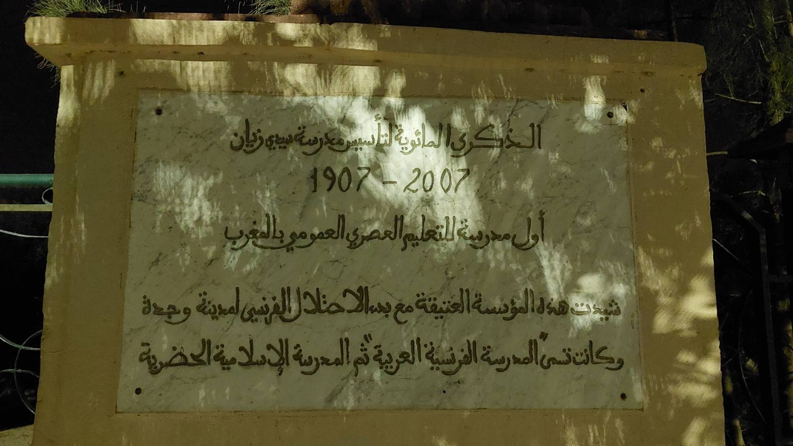
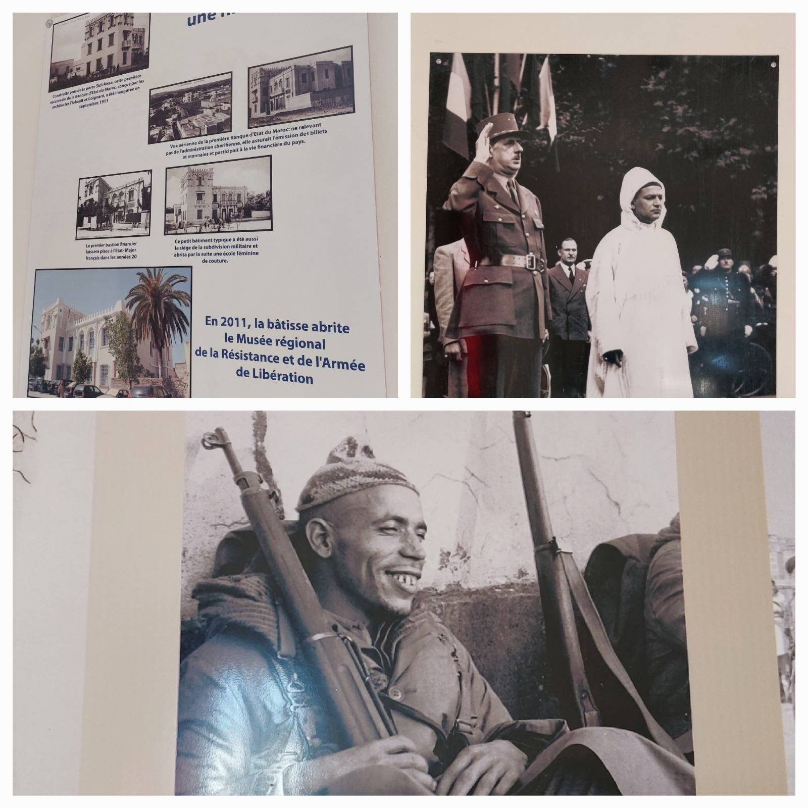

import MiniMap from '../../components/MiniMap.astro';

The Oriental region in Morocco doesn't always get the recognition it deserves in the tourism scene. In this post we will embark on a day trip adventure to explore the wonderful capital of this region: Oujda 🧡.

## The opening
Our journey kicks off at Oujda's train station. Just prior to the modern station, to the north, lies the historic one dating back to 1929. Notably, it's recognized as the first-ever train station in the area. A brief walk leads you to National Road N2. Head left, northward, towards the **Oujda Gallery**. Along the way, you'll encounter interesting spots like the **Jewish and Christian cemeteries**, as well as the **Saint Antoine de Padoue Church**.

Throughout its history and continuing to the present day, Oujda stands as a shining example of religious and ethnic tolerance. Over the past century, the city has warmly embraced individuals from diverse religions and races, embodying a spirit of inclusivity.

Take a stroll through the **Oujda Gallery** and enjoy paintings on display. Continue your journey along Rue Essadiyine towards the northern part of the city. As you approach the northern end, you'll discover the **Oujda Old Train Station**, a historic landmark dating back to the protectorate era. Once a crucial stop on the Mediterranean-Niger line. This station played a significant role, even though the ambitious railway project never reached Niger and terminated in Bechar, Algeria. Today, the station building serves as a city administration facility, retaining its original architecture that has stood the test of time.

> 💡 Bonus: You can take a small walk in the nearby **Oujda City Park**

Make your way to the city center, where you have the option to enjoy breakfast or take a coffee break at one of the cafes lining **Mohammed V street** (National Road N6) or opt for a more traditional experience in Marrakech Alley. If you choose the latter, be sure to grab some **Kaak** (Special Oujdi Biscuits) from the cafes on Rue Marrakech. With a satisfied stomach, kick off your city tour!

**Mohammed V** street boasts numerous stunning buildings dating back to the last century. Beginning from the **9th of July square**, you'll encounter the largest church in Oujda, **St. Louis Church**, and one of the city's most beautiful mosques, **Oum El Banin Mosque**. Together, in the same view, these architectural gems create one of the most picturesque scenes the city has to offer.

Continuing along the same street, you'll encounter several exquisite 20th-century buildings, with three declared as National Heritage:
- Bank al Maghreb Building
- "La poste" building
- Municipality Building

As you explore, don't miss the chance to appreciate the stunning architecture of **Omar Ibn AbdulAziz Mosque**.

Bonus tip: In the same neighborhood, you'll discover more buildings inscribed as national patrimony, including **Vox Cinema**, **Justice Palace**, and **Simon's Hotel**. It's a treasure trove of historical and architectural gems!

## Road to the borders
Now that you've explored the newer old part of the city center, let's go to the Borders!

As you make your way to the medina through **Rue Marrakech**, take note of the **Oujda synagogue** building along the route. Although the synagogue is no longer in operation, the building is well-preserved and has been repurposed as a CTM office.

Before heading out, make a quick stop at the Medina Market to pick up some fresh fruits or Oujdi sweets like **Kaak** or **Makrout** for the journey ahead. If you're not mobile, catch the N99 Bus on Moulay Hassan Street. Feel free to ask locals about the Hdada bus (Border Bus), and they'll guide you to the exact location. Get ready for the next leg of your adventure!

The bus journey will lead you through one of the less crowded parts of **National Road 6**, concluding at the Moroccan/Algerian border where the Algerian National Road begins. Upon arrival, the bus will drop you off at **Zouj Bghal** (2 Mules) Border Customs. It's important to mention that as of the writing of this article, the borders between Morocco and Algeria are closed, preventing passage to the other side.

On a positive note, you can enjoy lunch at the restaurant of the karting club. Additionally, for an exciting adventure, consider booking a Kart for 100 Dh (autumn 2023) and racing with your friends. I recommend opting for lunch on the rooftop to take in the view of the border.

> 💡 : Enjoy your time with the playful cat in the restaurant 😸

## Get lost in Medina on the Medina
After savoring lunch at the easternmost part of the country, let's make our way back to the Medina and get lost in its charming maze.

Starting from the north, head to **Morocco's Square** and enter the gate in front of you, navigating through **Sabouni Alley**. At the alley's end, take a moment to admire **Hadada Mosque**, one of the city's oldest, dating back to 1802 and commissioned by Alouite Sultan Moulay Slimane.

As you wander through the Medina's various souks and alleys, note that each handicraft specialty, be it carpentry, clothing, or jewelry, has its dedicated area where craftsmen and shop owners gather.

> 💡 This pattern is common in almost all Medinas in Morocco

Following your souk tour, return to **Khayyatin Alley**. When you reach the end, turn left and then right, where you'll encounter a striking wooden door – welcome to the **Marinid Quranic School**. Embracing the Marinid style from the 13th and 14th centuries, this school bears a resemblance to its counterparts in Fez and Salé and other cities.

In the same neighborhood, discover the **Great Mosque of Oujda**, erected in the 13th century during the reign of Abu Yaakoub Yusuf. Don't forget to pass by the renowned **Three Fountains**, dating back to the same era as the mosque and school. Adjacent to the Great Mosque, explore **Okba Mosque**, equally ancient. En route to Okba's Mosque, take in the **street art** adorning the Medina's streets and walls.

In this neighborhood, make time to visit **Houbous Market** and **Souk el Maa**. These vibrant spots offer a glimpse into the rich history and culture of Oujda.

## The new old
After soaking in the sights, sounds, and architecture of the Medina, backtrack to where you began, close to the **Three Fountains**. In the neighborhood near the **Sidi Ziane Mausoleum**, you'll encounter several buildings dating back to the Protectorate era or even earlier.

Start with **Hammam Jarda**, a structure predating the Protectorate, followed by **Sidi Ziane Primary School**, recognized as the first school ever built in Morocco. Nearby, discover the building that once housed the **Etat-Major of the French Army in Oujda**, now transformed into the **Memory of Resistance Museum**.

The **Memory of Resistance in Oujda** is part of the government's initiative to establish these type of museums in each city. This museum showcases artifacts related to the Protectorate and the resistance in the region. Entrance is free, making it a worthwhile visit, but be sure to check the opening hours.

Concluding our tour, exit the Medina through **Bab El Gharbi**, turning left to return to the starting point. Enter **Lalla Meryem Park** through the first door on your left, reveling in the beautiful greenery and a view of the city walls from the outside.

Wrap up your visit with a cup of coffee or tea under the trees at the park's café.

> 💡 Bonus tip: Consider visiting **Dar Sebti** after concluding your tour. While not open to the public, inquire with the guard about any possibilities for a visit.

## Sunset in the Medina
Continuing along the same alley towards **Bab Abdelouaheb**, be sure to experience the magic duo: **Karan** & **Barida**. In front of the gate, you're in for one of the best Oujdi experiences. Each afternoon, after the Asr Prayer, **Sidi Abdelouahab** Square transforms into a vibrant street art carnival with numerous halqas. These gatherings feature storytellers, magicians, musicians, and, best of all, a Reggada's Halqa.

In the Reggada Halqa, locals confident in their dancing skills enter the circle and challenge the musicians to a round of Reggada – a beautiful traditional dance renowned in the east of Morocco.

Before heading for dinner, don't miss the opportunity to witness the sunset at the Medina gates. It's one of the most breathtaking sunsets you can experience in Morocco.

## If you have a second day.
Indeed, Oujda has so much more to offer. Renowned as the city of mosques in Morocco and the world, it's second only to Istanbul in terms of the number of mosques. The medina is a captivating blend of old Marinid-style architecture (in the Kasbah district), newer structures from the Alaouite era, and a significant display of architecture from the Protectorate era.

Beyond its architectural richness, Oujda boasts a diverse natural patrimony. Explore the **Sidi Maafa** Forest for a refreshing breath of fresh air or climb the **Jorf Ouazzen** (Cliff) in the **Ras Asfour** area for a unique and scenic adventure. The city truly unfolds as a treasure trove of cultural and natural wonders waiting to be explored.

## Conclusion
Absolutely, despite being underrated, Oujda remains one of the most historically significant cities in Morocco and North Africa (~1000 years). Presently, it thrives both economically and culturally, offering a promising and often overlooked tourist destination. Oujda invites visitors to discover its rich history, diverse architecture, vibrant cultural scene, and the warmth of its people—a unique experience that adds to the colorful tapestry of Morocco's appeal.

To know more about Oujda and the Oriental region, check [this](/blog/top-7-moroccan-tourism-websites/#4-documentation-award-goes-to) out. And of course before we finish, here is the map for everything we talked about.

<MiniMap mapId="oujda" title="Oujda Tour" />
